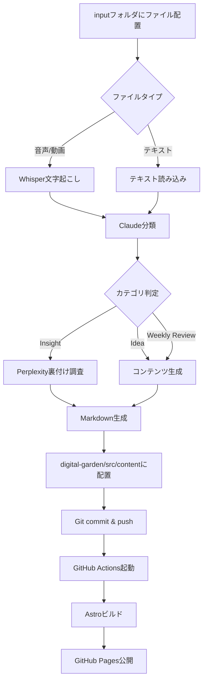

# 📅 日々の運用ガイド - Digital Garden

このドキュメントでは、inputフォルダにファイルを配置してから記事が公開されるまでの完全なフローと、日常的な運用方法について説明します。

## 🎯 概要

このDigital Gardenシステムは、音声メモ・動画・テキストから自動的にブログ記事を生成し、GitHub Pagesに公開する完全自動化パイプラインです。

```
音声/動画/テキスト → AI処理 → 分類 → 裏付け調査 → Git → GitHub Pages
```

---

## 📋 目次

1. [日常的な運用フロー](#日常的な運用フロー)
2. [詳細な処理フロー](#詳細な処理フロー)
3. [コンテンツタイプ別ガイド](#コンテンツタイプ別ガイド)
4. [トラブルシューティング](#トラブルシューティング)
5. [自動化されている処理](#自動化されている処理)

---

## 🚀 日常的な運用フロー

### ステップ1: コンテンツの準備

**音声メモの場合**
```bash
# 音声ファイルをinput/audio/に配置
cp ~/voice_memo.m4a input/audio/
```

**動画の場合**
```bash
# 動画ファイルをinput/video/に配置
cp ~/screen_recording.mp4 input/video/
```

**テキストメモの場合**
```bash
# テキストファイルをinput/text/に配置
cp ~/notes.txt input/text/
```

### ステップ2: 自動処理の実行

```bash
# 自動化パイプラインを実行
python automation/run_automation.py

# または詳細ログ付き実行
python automation/run_automation.py --verbose

# ドライラン（変更なし）でテスト
python automation/run_automation.py --dry-run
```

### ステップ3: 処理結果の確認

```bash
# 生成されたコンテンツを確認
ls digital-garden/src/content/insights/
ls digital-garden/src/content/ideas/
ls digital-garden/src/content/weekly-reviews/

# ローカルプレビュー
cd digital-garden
npm run dev
# → http://localhost:4321 で確認
```

### ステップ4: 公開（自動）

自動化パイプラインが完了すると：

1. ✅ Git commit自動作成
2. ✅ GitHub pushで自動デプロイ
3. ✅ GitHub Actions実行
4. ✅ GitHub Pagesに公開

**公開URL**: https://takenori-kusaka.github.io/personal/

---

## 🔄 詳細な処理フロー

### 完全な処理パイプライン



### 1️⃣ ファイル検出・前処理

**処理内容:**
- `input/audio/`, `input/video/`, `input/text/` をスキャン
- サポートされているファイル形式を検出
- ファイルサイズと形式の検証（最大500MB）

**対応ファイル形式:**
```yaml
音声: mp3, wav, flac, m4a, ogg
動画: mp4, avi, mov, mkv, webm
テキスト: txt, md, rtf
```

### 2️⃣ Whisper文字起こし（音声/動画のみ）

**使用モデル:** `kotoba-tech/kotoba-whisper-v2.0`（日本語最適化）

**処理内容:**
- 音声/動画を高精度でテキスト化
- セグメント単位でタイムスタンプ付き文字起こし
- 信頼度スコア計算（最小0.7以上）

**出力例:**
```json
{
  "text": "今日はAWSのLambda関数について学びました...",
  "segments": [
    {"start": 0.0, "end": 5.2, "text": "今日はAWSのLambda関数について学びました", "confidence": 0.95}
  ],
  "confidence_score": 0.92
}
```

### 3️⃣ Claude分類・構造化

**使用モデル:** `claude-3-5-sonnet-20241022`

**分類カテゴリ:**
- **Insight**: ビジネス洞察、技術学習、専門知識
- **Idea**: 新しいアイデア、将来構想、企画案
- **Weekly Review**: 週次振り返り、成長記録、目標評価

**生成される情報:**
```yaml
category: insight / idea / weekly-review
title: "記事タイトル"
summary: "要約（150文字）"
priority: high / medium / low
tags:
  - クラウド
  - AWS
  - Lambda
body: "構造化されたMarkdown本文"
```

### 4️⃣ Perplexity裏付け調査（Insightのみ）

**使用モデル:** `llama-3.1-sonar-small-128k-online`

**処理内容:**
- コンテンツの事実確認
- 最新情報の補足
- 信頼できる情報源の追加
- 誤情報の検出と修正

**調査項目:**
```yaml
検証ポイント:
  - 技術仕様の正確性
  - 最新バージョン情報
  - ベストプラクティスの妥当性
  - 統計データの信憑性

情報源:
  - 公式ドキュメント
  - 技術ブログ
  - 学術論文
  - 業界レポート
```

### 5️⃣ Markdown生成・配置

**生成されるファイル構造:**
```markdown
---
title: "AWSのLambda関数を使った効率的なデータ処理"
description: "Lambdaを活用したサーバーレスアーキテクチャの実装例"
pubDate: 2025-10-05
category: insight
tags:
  - クラウド
  - AWS
  - Lambda
  - サーバーレス
priority: high
---

## 概要

（本文）

## 学んだこと

（詳細）

## 参考資料

- [AWS Lambda Documentation](https://...)
```

**配置先:**
```
digital-garden/src/content/
├── insights/aws-lambda-efficient-data-processing.md
├── ideas/automation-pipeline-enhancement.md
└── weekly-reviews/2025-w40.md
```

### 6️⃣ Git自動化・デプロイ

**Gitフロー:**
```bash
# 自動実行される処理
git checkout -b automation/content-update-{timestamp}
git add digital-garden/src/content/
git commit -m "🤖 Automated content: insight - AWSのLambda関数..."
git push origin automation/content-update-{timestamp}

# GitHub上でPR自動作成（オプション）
gh pr create --title "..." --body "..."
```

**GitHub Actions:**
```yaml
トリガー: push to main branch
処理:
  1. Resumeファイル生成（profile.yml → resume.astro）
  2. Astroサイトビルド
  3. GitHub Pages公開
```

---

## 📝 コンテンツタイプ別ガイド

### 🔍 Insight（洞察・学び）

**推奨用途:**
- 技術学習の記録
- ビジネス洞察
- 専門知識の整理
- ベストプラクティスの発見

**音声メモの例:**
```
「今日AWSのLambda関数を使ってデータ処理パイプラインを
実装してみました。サーバーレスアーキテクチャのメリットは
コスト削減と自動スケーリングです。具体的には...」
```

**生成される記事:**
- Perplexityによる事実確認・最新情報追加
- 技術的な正確性の検証
- 参考資料の自動付与
- 関連タグの自動付与

### 💡 Idea（アイデア・構想）

**推奨用途:**
- 新しいプロジェクトアイデア
- 改善提案
- 将来の展望
- 創造的思考の記録

**テキストメモの例:**
```
# 自動化パイプラインの拡張案

音声メモから記事生成だけでなく、YouTube動画の
自動アップロードも組み込めないだろうか？

## 構想
1. 音声を動画編集ソフトで自動編集
2. サムネイル自動生成
3. YouTube API経由でアップロード
```

**生成される記事:**
- アイデアの構造化
- 実現可能性の検討
- 次のアクション項目の抽出

### 📅 Weekly Review（週次振り返り）

**推奨用途:**
- 週次の成長記録
- 目標の振り返り
- 学びの統合
- 次週の計画

**音声メモの例:**
```
「今週の振り返りです。月曜日から金曜日まで、
Digital Gardenシステムの構築に集中しました。
特に自動化パイプラインの実装が大きな進展でした...」
```

**生成される記事:**
- 週次サマリーの構造化
- 達成項目の明確化
- 学びの抽出
- 次週への提言

---

## 🛠️ トラブルシューティング

### よくある問題と解決方法

#### 1. 文字起こしが失敗する

**症状:**
```
Error: Whisper transcription failed
```

**原因と対策:**
```bash
# 原因1: ファイルが大きすぎる（>500MB）
# 対策: ファイルを分割するか圧縮

# 原因2: 音声品質が低い
# 対策: より明瞭な音声で録音

# 原因3: GPUメモリ不足
# 対策: CPUモードに切り替え
# automation/config/custom.yaml
transcription:
  device: "cpu"
```

#### 2. 分類が正しくない

**症状:**
```
InsightがIdeaに分類されてしまう
```

**対策:**
```bash
# より明確なコンテンツ構造を使用
# 音声メモの場合:
「これは洞察です。今日学んだことは...」  # Insightと明示
「アイデアを思いつきました。...」       # Ideaと明示
「今週の振り返りです。...」            # Weekly Reviewと明示
```

#### 3. Perplexity調査が遅い

**症状:**
```
Research taking too long
```

**対策:**
```bash
# タイムアウト時間を延長
# automation/config/custom.yaml
research:
  timeout: 90  # 45秒 → 90秒
```

#### 4. GitHub Pagesに反映されない

**チェック項目:**
```bash
# 1. GitHub Actionsの実行確認
gh workflow list
gh run list

# 2. ビルドログ確認
gh run view <run-id> --log

# 3. ローカルビルドテスト
cd digital-garden
npm run build
```

---

## ⚙️ 自動化されている処理

### ✅ 完全自動化

以下の処理は人手を介さず自動実行されます:

1. **ファイル検出**: input/配下の新規ファイル自動検出
2. **文字起こし**: Whisperによる音声→テキスト変換
3. **分類**: Claudeによるカテゴリ判定
4. **調査**: Perplexityによる事実確認・情報補足
5. **生成**: Markdown記事の構造化生成
6. **配置**: digital-garden/src/content/への配置
7. **Git操作**: commit, push, PR作成
8. **ビルド**: Astroサイトの自動ビルド
9. **公開**: GitHub Pagesへのデプロイ
10. **アーカイブ**: 処理済みファイルのinput/processed/移動

### 📋 Resume更新の自動化

**profile.yml編集時の自動フロー:**

```bash
# 1. profile.ymlを編集
vim data/profile.yml

# 2. commit & push
git add data/profile.yml
git commit -m "Update profile"
git push

# 3. GitHub Actions自動実行
# → python src/main.py でresume生成
# → output/resume.html → digital-garden/src/pages/resume.astro
# → Astroビルド
# → GitHub Pages公開
```

---

## 🎓 ベストプラクティス

### 音声メモのコツ

```
良い例:
「これは技術的な洞察です。今日AWSのLambdaを使って
サーバーレスアーキテクチャを実装しました。
ポイントは3つあります。1つ目は...」

避けるべき:
「えーと、なんか、あのー、今日は...」
（フィラーが多すぎると文字起こし精度低下）
```

### ファイル命名規則

```bash
# 推奨: 日付+内容
20251005-aws-lambda-learning.m4a
20251005-automation-idea.txt
20251005-weekly-review.mp3

# 非推奨: 曖昧な名前
voice001.m4a
memo.txt
recording.mp4
```

### タグの効果的な使用

```markdown
# 効果的なタグ例
tags:
  - クラウド        # 大カテゴリ
  - AWS            # プラットフォーム
  - Lambda         # 具体的技術
  - サーバーレス    # アーキテクチャパターン

# 避けるべき
tags:
  - 勉強
  - メモ
  - その他
```

---

## 📊 処理時間の目安

| 処理 | 時間（目安） |
|------|-------------|
| 音声文字起こし（10分） | 2-3分 |
| Claude分類 | 5-10秒 |
| Perplexity調査 | 10-20秒 |
| Markdown生成 | 3-5秒 |
| Git操作 | 5-10秒 |
| GitHub Actions | 2-3分 |
| **合計（音声10分）** | **約5-7分** |

---

## 🔍 ログ確認

```bash
# 自動化パイプラインのログ
tail -f logs/automation.log

# GitHub Actionsログ
gh run list
gh run view <run-id> --log

# Astroビルドログ
cd digital-garden
npm run build 2>&1 | tee build.log
```

---

## 📚 関連ドキュメント

- [プロジェクト全体構成](./PROJECT_OVERVIEW.md)
- [技術アーキテクチャ](./TECHNICAL_ARCHITECTURE.md)
- [API設定ガイド](./API_SETUP_GUIDE.md)
- [自動化システムREADME](../automation/README.md)

---

**最終更新**: 2025-10-05
**バージョン**: 2.0
