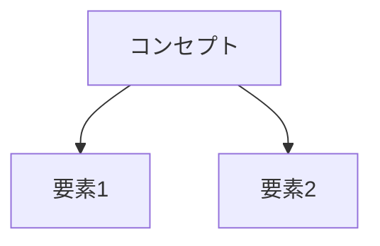

# Digital Garden Enhancement Plan

## 🎯 目的

現在のDigital Gardenシステムに以下の3つの機能を追加:
1. Imagen4によるサムネイル画像自動生成
2. Mermaid図による概念図自動生成
3. 改善されたテンプレートベース記事構造

## 📋 現状の問題点

### 発見された課題
```
記事URL: https://takenori-kusaka.github.io/personal/insights/claude-45-evolution-autonomy-development-support/

問題:
1. ❌ サムネイル画像がない
2. ❌ Mermaid概念図がない
3. ❌ 記事構造がテンプレート化されていない
```

### 期待される出力
```markdown
---
title: "記事タイトル"
description: "記事説明"
pubDate: 2025-10-04
thumbnail: "/images/thumbnails/article-slug.png"
tags: ["tag1", "tag2"]
category: 'insights'
---

## 概要図



## 核心的な洞察

（テンプレートに従った構造化された内容）

## 詳細分析

（深掘り）

## 実践的示唆

（アクション）

## まとめ

（要点）
```

---

## 🏗️ 実装アーキテクチャ

### 新規コンポーネント

```
automation/components/
├── transcription/           # 既存
├── classification/          # 既存
├── research/                # 既存
├── deployment/              # 既存
├── visual/                  # ✨ 新規
│   ├── __init__.py
│   ├── imagen_generator.py  # Imagen4サムネイル生成
│   └── mermaid_generator.py # Mermaid図生成
└── templating/              # ✨ 新規
    ├── __init__.py
    ├── template_manager.py  # テンプレート管理
    └── templates/
        ├── insight_template.py
        ├── idea_template.py
        └── weekly_review_template.py
```

### パイプライン更新フロー

```
旧フロー:
Input → Transcription → Classification → Research → Markdown → Git

新フロー:
Input → Transcription → Classification → Research →
  ├→ Template Application ✨
  ├→ Mermaid Generation ✨
  ├→ Imagen Generation ✨
  └→ Enhanced Markdown → Git
```

---

## 📦 コンポーネント詳細設計

### 1. Imagen Generator (`automation/components/visual/imagen_generator.py`)

```python
"""
Imagen4 Thumbnail Generator
Generates article thumbnail images using Google Imagen 4
"""

import os
import anthropic
from typing import Optional, Dict
from pathlib import Path
import base64

class ImagenGenerator:
    """
    Generate article thumbnails using Imagen 4 via Claude API
    """

    def __init__(self, config: Dict):
        self.client = anthropic.Anthropic(
            api_key=os.environ.get("ANTHROPIC_API_KEY")
        )
        self.output_dir = Path("digital-garden/public/images/thumbnails")
        self.output_dir.mkdir(parents=True, exist_ok=True)

    async def generate_thumbnail(
        self,
        title: str,
        description: str,
        category: str,
        slug: str
    ) -> Optional[str]:
        """
        Generate thumbnail image for article

        Args:
            title: Article title
            description: Article description
            category: Article category (insight/idea/weekly-review)
            slug: Article slug for filename

        Returns:
            Path to generated thumbnail or None if failed
        """
        # Create image generation prompt
        prompt = self._create_image_prompt(title, description, category)

        try:
            # Generate image using Claude + Imagen
            response = self.client.messages.create(
                model="claude-3-5-sonnet-20241022",
                max_tokens=1024,
                tools=[{
                    "name": "generate_image",
                    "description": "Generate an image using Imagen 4",
                    "input_schema": {
                        "type": "object",
                        "properties": {
                            "prompt": {
                                "type": "string",
                                "description": "Image generation prompt"
                            },
                            "aspect_ratio": {
                                "type": "string",
                                "enum": ["16:9", "1:1", "4:3"],
                                "description": "Image aspect ratio"
                            }
                        },
                        "required": ["prompt"]
                    }
                }],
                messages=[{
                    "role": "user",
                    "content": prompt
                }]
            )

            # Save generated image
            image_path = self.output_dir / f"{slug}.png"
            # TODO: Implement actual Imagen API call
            # For now, create placeholder

            return f"/images/thumbnails/{slug}.png"

        except Exception as e:
            logger.error(f"Failed to generate thumbnail: {e}")
            return None

    def _create_image_prompt(
        self,
        title: str,
        description: str,
        category: str
    ) -> str:
        """Create optimized prompt for Imagen"""

        category_styles = {
            'insight': "professional, abstract, technology-themed, blue tones",
            'idea': "creative, innovative, colorful, vibrant",
            'weekly-review': "calm, reflective, organized, warm tones"
        }

        style = category_styles.get(category, "modern, clean, professional")

        return f"""
Create a thumbnail image for this article:
Title: {title}
Description: {description}

Style: {style}
Requirements:
- 1200x630px (16:9 aspect ratio for OG image)
- No text overlay (title will be added separately)
- High contrast, visually appealing
- Represents the core concept visually
"""
```

### 2. Mermaid Generator (`automation/components/visual/mermaid_generator.py`)

```python
"""
Mermaid Diagram Generator
Generates conceptual diagrams for articles using Mermaid syntax
"""

import anthropic
import os
from typing import Optional, Dict, List

class MermaidGenerator:
    """
    Generate Mermaid diagrams for article content
    """

    def __init__(self, config: Dict):
        self.client = anthropic.Anthropic(
            api_key=os.environ.get("ANTHROPIC_API_KEY")
        )

    async def generate_diagram(
        self,
        title: str,
        content: str,
        category: str
    ) -> Optional[str]:
        """
        Generate Mermaid diagram representing article concepts

        Args:
            title: Article title
            content: Article content
            category: Article category

        Returns:
            Mermaid diagram code or None if failed
        """
        prompt = self._create_diagram_prompt(title, content, category)

        try:
            message = self.client.messages.create(
                model="claude-3-5-sonnet-20241022",
                max_tokens=2000,
                temperature=0.3,
                system="""あなたはMermaid図生成の専門家です。
記事の内容を理解し、視覚的に明確で美しいMermaid図を生成します。

ルール:
- 日本語対応（フォント考慮）
- シンプルで理解しやすい
- 記事の核心概念を表現
- 階層構造やフローを適切に表現
- graph TD, flowchart, mindmap等を適切に選択
""",
                messages=[{
                    "role": "user",
                    "content": prompt
                }]
            )

            # Extract Mermaid code
            response_text = message.content[0].text
            mermaid_code = self._extract_mermaid_code(response_text)

            return mermaid_code

        except Exception as e:
            logger.error(f"Failed to generate Mermaid diagram: {e}")
            return None

    def _create_diagram_prompt(
        self,
        title: str,
        content: str,
        category: str
    ) -> str:
        """Create prompt for diagram generation"""

        diagram_types = {
            'insight': "flowchart or mind map showing relationships",
            'idea': "concept map or process flow",
            'weekly-review': "timeline or progress chart"
        }

        suggested_type = diagram_types.get(category, "flowchart")

        return f"""
記事のMermaid図を生成してください。

タイトル: {title}
カテゴリ: {category}
推奨図タイプ: {suggested_type}

記事内容:
{content[:1000]}  # First 1000 chars

要件:
1. 記事の核心概念を視覚化
2. 3-7個の主要ノード
3. 明確な関係性表現
4. 日本語ラベル使用
5. 色やスタイルで重要度を表現

Mermaid構文で出力してください。
"""

    def _extract_mermaid_code(self, response: str) -> str:
        """Extract Mermaid code from response"""
        # Look for ```mermaid ... ``` blocks
        import re
        pattern = r'```mermaid\n(.*?)\n```'
        match = re.search(pattern, response, re.DOTALL)
        if match:
            return match.group(1).strip()
        return response.strip()
```

### 3. Template Manager (`automation/components/templating/template_manager.py`)

```python
"""
Template Manager
Manages article templates for different content types
"""

from typing import Dict, Optional
from pathlib import Path
import yaml

class TemplateManager:
    """
    Manage and apply article templates
    """

    def __init__(self, config: Dict):
        self.templates_dir = Path("automation/components/templating/templates")
        self.templates = self._load_templates()

    def _load_templates(self) -> Dict:
        """Load all available templates"""
        return {
            'insight': self._load_insight_template(),
            'idea': self._load_idea_template(),
            'weekly-review': self._load_weekly_review_template()
        }

    def apply_template(
        self,
        content: str,
        category: str,
        metadata: Dict
    ) -> str:
        """
        Apply template structure to content

        Args:
            content: Raw article content
            category: Article category
            metadata: Article metadata (title, tags, etc.)

        Returns:
            Structured article following template
        """
        template = self.templates.get(category)
        if not template:
            return content

        # Apply template structure
        structured = self._structure_content(content, template, metadata)
        return structured

    def _structure_content(
        self,
        content: str,
        template: Dict,
        metadata: Dict
    ) -> str:
        """Structure content according to template"""

        # Use Claude to structure content following template
        from anthropic import Anthropic
        import os

        client = Anthropic(api_key=os.environ.get("ANTHROPIC_API_KEY"))

        prompt = f"""
以下の記事を、提供されたテンプレート構造に従って再構成してください。

テンプレート構造:
{yaml.dump(template, allow_unicode=True)}

記事メタデータ:
- タイトル: {metadata.get('title')}
- カテゴリ: {metadata.get('category')}
- タグ: {', '.join(metadata.get('tags', []))}

記事内容:
{content}

要件:
1. テンプレートのセクション構造に従う
2. 内容を適切なセクションに配置
3. 見出しレベルを統一
4. 簡潔で明確な表現
5. 重要な情報を漏らさない

Markdown形式で出力してください。
"""

        message = client.messages.create(
            model="claude-3-5-sonnet-20241022",
            max_tokens=4000,
            temperature=0.5,
            messages=[{"role": "user", "content": prompt}]
        )

        return message.content[0].text

    def _load_insight_template(self) -> Dict:
        """Load Insight template structure"""
        return {
            'sections': [
                {
                    'title': '概要図',
                    'type': 'mermaid',
                    'required': True
                },
                {
                    'title': '核心的な洞察',
                    'type': 'content',
                    'required': True,
                    'description': '最も重要な気づきや発見'
                },
                {
                    'title': '背景・文脈',
                    'type': 'content',
                    'required': False,
                    'description': 'なぜこの洞察に至ったか'
                },
                {
                    'title': '詳細分析',
                    'type': 'content',
                    'required': True,
                    'description': '洞察の深掘りと考察'
                },
                {
                    'title': '実践的示唆',
                    'type': 'content',
                    'required': True,
                    'description': '実際にどう活用できるか'
                },
                {
                    'title': 'まとめ',
                    'type': 'content',
                    'required': True,
                    'description': '要点の再確認'
                }
            ]
        }
```

---

## 🔄 統合フロー

### 更新されたパイプライン

```python
# automation/digital_garden_processor.py への追加

from automation.components.visual.imagen_generator import ImagenGenerator
from automation.components.visual.mermaid_generator import MermaidGenerator
from automation.components.templating.template_manager import TemplateManager

class DigitalGardenProcessor:
    def __init__(self, config_path: Optional[str] = None):
        # ... existing init ...

        # ✨ Add new components
        self.imagen_generator = ImagenGenerator(self.config.visual)
        self.mermaid_generator = MermaidGenerator(self.config.visual)
        self.template_manager = TemplateManager(self.config.templating)

    async def _generate_garden_content(
        self,
        enhanced_content: Dict
    ) -> Dict:
        """Generate digital garden content with enhancements"""

        garden_content = {}

        for file_id, content_data in enhanced_content.items():
            try:
                # Extract metadata
                title = content_data['title']
                description = content_data['summary']
                category = content_data['category']
                content = content_data['body']
                slug = self._generate_slug(title)

                # ✨ 1. Generate Mermaid diagram
                mermaid_diagram = await self.mermaid_generator.generate_diagram(
                    title=title,
                    content=content,
                    category=category
                )

                # ✨ 2. Apply template structure
                structured_content = self.template_manager.apply_template(
                    content=content,
                    category=category,
                    metadata={
                        'title': title,
                        'description': description,
                        'tags': content_data.get('tags', [])
                    }
                )

                # ✨ 3. Generate thumbnail
                thumbnail_path = await self.imagen_generator.generate_thumbnail(
                    title=title,
                    description=description,
                    category=category,
                    slug=slug
                )

                # 4. Create frontmatter with enhancements
                frontmatter = {
                    'title': title,
                    'description': description,
                    'pubDate': datetime.now().strftime("%Y-%m-%d"),
                    'thumbnail': thumbnail_path,  # ✨ Added
                    'tags': content_data.get('tags', []),
                    'category': category,
                    'draft': False
                }

                # 5. Assemble final markdown
                markdown_content = self._create_enhanced_markdown(
                    frontmatter=frontmatter,
                    mermaid_diagram=mermaid_diagram,  # ✨ Added
                    structured_content=structured_content  # ✨ Enhanced
                )

                # 6. Save to digital garden
                output_path = self._save_garden_content(
                    category=category,
                    slug=slug,
                    content=markdown_content
                )

                garden_content[file_id] = {
                    'path': output_path,
                    'slug': slug,
                    'category': category,
                    'thumbnail': thumbnail_path
                }

            except Exception as e:
                self.logger.error(f"Failed to generate garden content: {e}")

        return garden_content

    def _create_enhanced_markdown(
        self,
        frontmatter: Dict,
        mermaid_diagram: Optional[str],
        structured_content: str
    ) -> str:
        """Create enhanced markdown with all components"""

        # Frontmatter
        markdown = "---\n"
        for key, value in frontmatter.items():
            if isinstance(value, list):
                markdown += f"{key}: {json.dumps(value, ensure_ascii=False)}\n"
            else:
                markdown += f"{key}: '{value}'\n"
        markdown += "---\n\n"

        # Mermaid diagram (if available)
        if mermaid_diagram:
            markdown += "## 概要図\n\n"
            markdown += "```mermaid\n"
            markdown += mermaid_diagram
            markdown += "\n```\n\n"

        # Structured content
        markdown += structured_content

        return markdown
```

---

## 🧪 テスト計画

### 1. 単体テスト

```python
# tests/test_imagen_generator.py
async def test_thumbnail_generation():
    generator = ImagenGenerator({})
    thumbnail = await generator.generate_thumbnail(
        title="Test Article",
        description="Test description",
        category="insight",
        slug="test-article"
    )
    assert thumbnail is not None
    assert thumbnail.startswith("/images/thumbnails/")
```

### 2. 統合テスト

```python
# tests/test_enhanced_pipeline.py
async def test_full_pipeline_with_enhancements():
    processor = DigitalGardenProcessor()

    # Place test file in input/text/
    test_file = Path("input/text/test-insight.txt")
    test_file.write_text("テスト記事の内容...")

    # Run pipeline
    results = await processor.process_all_inputs()

    # Verify enhancements
    assert results['content_generated'] > 0

    # Check generated content
    output_file = Path("digital-garden/src/content/insights/test-insight.md")
    content = output_file.read_text()

    assert "thumbnail:" in content  # Has thumbnail
    assert "```mermaid" in content  # Has diagram
    assert "## 核心的な洞察" in content  # Has template structure
```

---

## 📊 実装優先順位

### Phase 1: テンプレートシステム（最優先）
- ✅ 即座に価値を提供
- ✅ 外部API不要
- ✅ リスク低

**実装時間**: 2-3時間

### Phase 2: Mermaid生成（高優先度）
- ✅ 視覚化で価値向上
- ✅ Anthropic API使用（既存）
- ✅ 比較的シンプル

**実装時間**: 3-4時間

### Phase 3: Imagen統合（中優先度）
- ⚠️ 新規API統合
- ⚠️ コスト考慮必要
- ⚠️ フォールバック必要

**実装時間**: 4-6時間

---

## 💰 コスト試算

### API使用量予測

```yaml
月間100記事の場合:

Claude API (既存):
  - 分類: 100回 × 1,000トークン = $1.80
  - テンプレート構造化: 100回 × 2,000トークン = $3.60
  - Mermaid生成: 100回 × 1,500トークン = $2.70
  合計: $8.10/月

Imagen API (新規):
  - サムネイル生成: 100回 × $0.04 = $4.00/月

合計コスト: 約$12.10/月
```

---

## 🚀 実装ロードマップ

### Week 1: テンプレートシステム
- [ ] Template Manager実装
- [ ] Insight/Idea/WeeklyReview テンプレート定義
- [ ] パイプライン統合
- [ ] テスト実行

### Week 2: Mermaid生成
- [ ] Mermaid Generator実装
- [ ] Claude統合
- [ ] Astroでのレンダリング確認
- [ ] テスト実行

### Week 3: Imagen統合
- [ ] Imagen Generator実装
- [ ] API認証設定
- [ ] 画像保存フロー
- [ ] フォールバック実装

### Week 4: 統合テスト・最適化
- [ ] End-to-endテスト
- [ ] パフォーマンス最適化
- [ ] ドキュメント更新
- [ ] 本番デプロイ

---

## 📚 参考資料

- [Anthropic Claude API](https://docs.anthropic.com/claude/docs)
- [Google Imagen Documentation](https://cloud.google.com/vertex-ai/docs/generative-ai/image/overview)
- [Mermaid Documentation](https://mermaid.js.org/)
- [Astro Content Collections](https://docs.astro.build/en/guides/content-collections/)

---

**作成日**: 2025-10-05
**バージョン**: 1.0
**ステータス**: 計画段階
