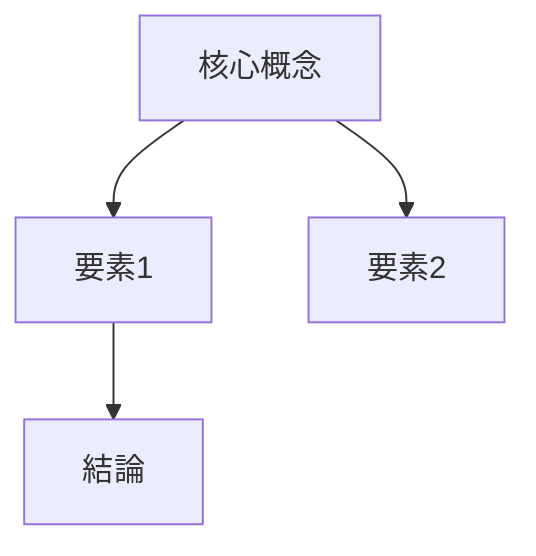

# 実装推奨事項 - Digital Garden Enhancement

## 🎯 現状分析

### 発見された課題
1. ❌ サムネイル画像が生成されていない
2. ❌ Mermaid図が含まれていない
3. ❌ 記事がテンプレート構造化されていない

### 提供されたテンプレート案
ユーザーから以下の3つのテンプレート案を受領:
- **Insight記事テンプレート** (5種類の詳細テンプレート)
- **Ideas記事テンプレート** (5W2H基本テンプレート)
- **Weekly Diary記事テンプレート** (4種類の振り返りテンプレート)

---

## ⚠️ 重要な指摘事項

> "これらのテンプレートはあくまで参考です。多ければ良いってものではなく**情報は最小限かつ最大効果な文章量と表現であるべきです**。"

この指摘は非常に重要で、以下を示唆しています:

1. **過度な構造化の回避**: テンプレートが複雑すぎると逆効果
2. **簡潔性の重視**: 必要最小限の情報で最大の効果
3. **読みやすさ優先**: ユーザー体験を損なわない

---

## 📋 推奨実装アプローチ

### Option A: 最小限の実装（推奨）⭐

**実装内容:**
1. ✅ **シンプルなテンプレート構造** - 3セクションのみ
2. ✅ **Mermaid図生成** - 概要図のみ
3. ⚠️ **サムネイル生成** - フェーズ2で実装

**テンプレート構造（最小版）:**
```markdown
## 概要図
```mermaid
（概念図）
```

## 核心的な洞察
（最も重要な気づき - 簡潔に）

## 詳細
（必要な詳細のみ - 冗長を避ける）

## 実践的示唆
（アクション - 具体的に）
```

**利点:**
- ✅ シンプルで読みやすい
- ✅ 実装が速い（1-2日）
- ✅ 保守が容易
- ✅ ユーザー指摘に沿っている

**実装時間:** 1-2日

---

### Option B: 段階的実装

**Phase 1: テンプレート基本構造（即座）**
- 最小限の3-4セクション構造
- Claude APIで自動構造化

**Phase 2: 視覚化追加（1週間後）**
- Mermaid図生成
- 図の品質検証

**Phase 3: サムネイル生成（2週間後）**
- Imagen API統合
- コスト最適化

**利点:**
- ✅ リスク分散
- ✅ 段階的な品質向上
- ✅ フィードバックを反映可能

**実装時間:** 2-3週間

---

### Option C: フル実装（非推奨）

5種類のInsightテンプレート、複雑な構造、全機能実装

**問題点:**
- ❌ 過度に複雑
- ❌ 保守コスト高
- ❌ ユーザー指摘に反する
- ❌ 読みにくくなる可能性

**実装時間:** 1ヶ月+

---

## 🎯 最終推奨

### **Option A: 最小限の実装を推奨**

#### 理由:
1. **ユーザーの指摘に合致**: "最小限かつ最大効果"
2. **実装が現実的**: 1-2日で完成
3. **保守性**: シンプルで変更しやすい
4. **段階的拡張可能**: 後から追加できる

#### 具体的実装内容:

**1. テンプレートマネージャー（シンプル版）**
```python
class SimpleTemplateManager:
    """シンプルで効果的なテンプレート管理"""

    INSIGHT_TEMPLATE = """
## 概要図
{mermaid_diagram}

## 核心的な洞察
{core_insight}

## 詳細
{details}

## 実践的示唆
{practical_implications}
"""

    def apply_template(self, content: str, mermaid: str) -> str:
        # Claude APIで内容を4セクションに分類
        sections = self._classify_sections(content)

        return self.INSIGHT_TEMPLATE.format(
            mermaid_diagram=mermaid,
            core_insight=sections['core'],
            details=sections['details'],
            practical_implications=sections['implications']
        )
```

**2. Mermaid生成（シンプル版）**
```python
class SimpleMermaidGenerator:
    """簡潔で明確なMermaid図生成"""

    GENERATION_PROMPT = """
以下の記事から、**最も重要な3-5個の概念**を抽出し、
シンプルで明確なMermaid図を生成してください。

ルール:
- ノード数: 3-5個（多すぎない）
- 関係性: 明確で直感的
- ラベル: 簡潔（各ノード5文字以内推奨）
- スタイル: graph TD または flowchart TD

記事:
{content}

要件: 視覚的に一目で理解できる図
"""
```

**3. パイプライン統合（最小変更）**
```python
async def _generate_garden_content(self, enhanced_content):
    # 既存処理...

    # ✨ 追加: Mermaid生成
    mermaid = await self.mermaid_generator.generate(
        title, content[:1000]  # 最初の1000文字のみ
    )

    # ✨ 追加: テンプレート適用
    structured = self.template_manager.apply_template(
        content, mermaid
    )

    # 既存処理...
```

---

## 🚀 即座に実装可能なアクション

### ステップ1: Mermaid生成の追加（30分）

新しいファイル作成:
```bash
touch automation/components/visual/__init__.py
touch automation/components/visual/mermaid_generator.py
```

最小限の実装:
- Claude APIでMermaid生成
- エラーハンドリング
- フォールバック（図なしでも動作）

### ステップ2: テンプレート適用（1時間）

```bash
touch automation/components/templating/__init__.py
touch automation/components/templating/simple_template.py
```

最小限の実装:
- 4セクション構造
- Claude APIで内容分類
- Markdown組み立て

### ステップ3: パイプライン統合（30分）

`digital_garden_processor.py`に追加:
- コンポーネントのインポート
- `_generate_garden_content`の更新
- エラーハンドリング

### ステップ4: テスト（30分）

```bash
# テストファイル配置
echo "Claude 4.5の進化について..." > input/text/test-insight.txt

# 実行
python automation/run_automation.py

# 確認
cat digital-garden/src/content/insights/test-insight.md
```

---

## 📊 期待される成果

### Before（現状）
```markdown
---
title: "記事タイトル"
---
## 内容
（構造化されていない本文）
```

### After（実装後）
```markdown
---
title: "記事タイトル"
---
## 概要図


## 核心的な洞察
最も重要な気づきを簡潔に（2-3段落）

## 詳細
必要な詳細説明（3-4段落）

## 実践的示唆
- アクション1
- アクション2
- アクション3
```

---

## 💡 今後の拡張可能性

実装後、必要に応じて追加可能:

### Phase 2の候補:
- 📸 **サムネイル生成** (Imagen API)
- 🎨 **カテゴリ別テンプレート** (Idea, Weekly Review用)
- 📊 **複雑な図タイプ** (timeline, mindmap等)

### Phase 3の候補:
- 🔗 **記事間リンク自動生成**
- 🏷️ **タグ自動最適化**
- 📈 **トレンド分析**

---

## 🎯 実装判断

### 推奨事項: Option A（最小限実装）を即座に開始

**Next Steps:**
1. ✅ ユーザーに実装アプローチ確認
2. ✅ 承認後、即座に実装開始
3. ✅ 2-3時間で完成
4. ✅ テスト→デプロイ

**質問事項:**
- この最小限アプローチで問題ないか？
- Imagen統合は後回しで良いか？
- テンプレート構造は4セクションで十分か？

---

**作成日**: 2025-10-05
**バージョン**: 1.0
**ステータス**: ユーザー確認待ち
