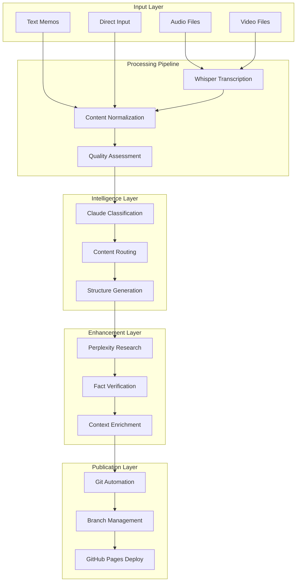
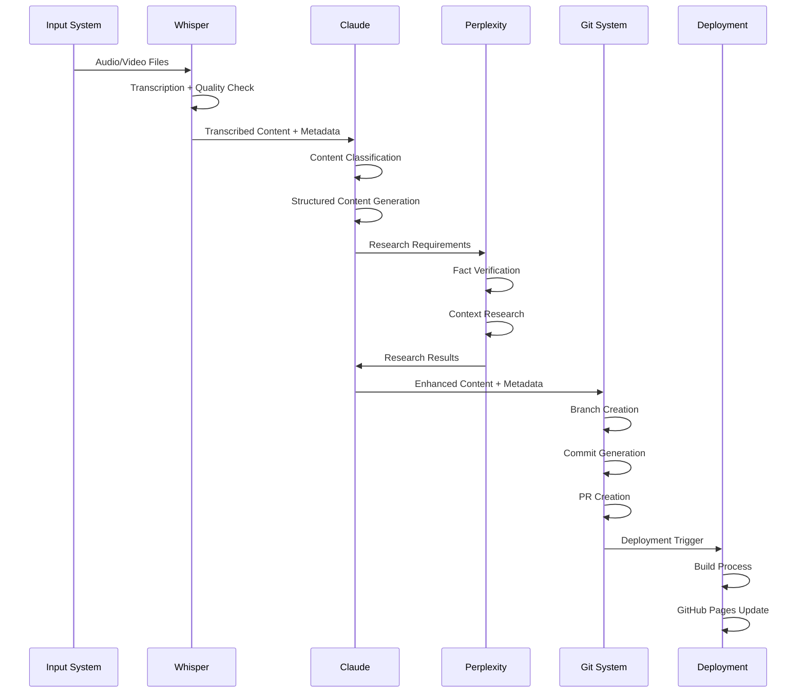

# Digital Garden Automation Components - Technical Design Specification

**Project**: Enhanced Digital Garden Automation System
**Version**: 2.0
**Date**: 2025-10-04

---

## 🎯 System Architecture Overview

### High-Level Component Architecture


---

## 📋 Component 1: Enhanced Whisper Transcription System

### 1.1 Component Overview
**Purpose**: Robust audio/video transcription with quality assessment and metadata extraction
**Technology**: Transformers + Whisper + PyTorch
**Performance Target**: >95% accuracy, <30s processing per minute of audio

### 1.2 Technical Specification

#### Data Models
```python
from dataclasses import dataclass
from pathlib import Path
from typing import Dict, List, Optional, Union
from enum import Enum
import datetime

class AudioQuality(Enum):
    EXCELLENT = "excellent"  # >95% confidence
    GOOD = "good"           # 85-95% confidence
    FAIR = "fair"           # 70-85% confidence
    POOR = "poor"           # <70% confidence

@dataclass
class AudioMetadata:
    duration: float
    sample_rate: int
    channels: int
    bitrate: Optional[int]
    format: str
    size_bytes: int
    created_at: datetime.datetime
    recording_device: Optional[str]

@dataclass
class TranscriptionSegment:
    start: float
    end: float
    text: str
    confidence: float
    speaker: Optional[str] = None
    language: str = "ja"

@dataclass
class TranscriptionResult:
    text: str
    confidence: float
    segments: List[TranscriptionSegment]
    processing_time: float
    source_file: Path
    audio_metadata: AudioMetadata
    quality: AudioQuality
    language_detected: str
    warning_flags: List[str]

    def to_dict(self) -> Dict:
        """Serialize to dictionary for JSON storage"""
        return {
            'text': self.text,
            'confidence': self.confidence,
            'segments': [segment.__dict__ for segment in self.segments],
            'processing_time': self.processing_time,
            'source_file': str(self.source_file),
            'audio_metadata': self.audio_metadata.__dict__,
            'quality': self.quality.value,
            'language_detected': self.language_detected,
            'warning_flags': self.warning_flags,
            'processed_at': datetime.datetime.now().isoformat()
        }
```

#### Core Interface
```python
class ITranscriptionProcessor:
    """Abstract interface for transcription processors"""

    async def process_file(self, input_path: Path) -> TranscriptionResult:
        """Process single audio/video file"""
        raise NotImplementedError

    async def batch_process(self, input_dir: Path,
                          file_patterns: List[str] = None) -> List[TranscriptionResult]:
        """Process multiple files concurrently"""
        raise NotImplementedError

    def get_supported_formats(self) -> List[str]:
        """Return list of supported file formats"""
        raise NotImplementedError

    async def health_check(self) -> Dict[str, any]:
        """System health and readiness check"""
        raise NotImplementedError

class EnhancedWhisperProcessor(ITranscriptionProcessor):
    """Production-ready Whisper transcription processor"""

    def __init__(self, config: Dict):
        self.config = config
        self.model_id = config.get('model_id', 'kotoba-tech/kotoba-whisper-v2.0')
        self.device = self._determine_device()
        self.model = None  # Lazy loading
        self.supported_formats = ['.m4a', '.wav', '.mp3', '.mp4', '.mov', '.avi']

    def _determine_device(self) -> Union[int, str]:
        """Intelligently determine optimal processing device"""
        if torch.cuda.is_available():
            gpu_memory = torch.cuda.get_device_properties(0).total_memory
            if gpu_memory >= 8 * 1024**3:  # 8GB+
                return 0
        return "cpu"

    async def process_file(self, input_path: Path) -> TranscriptionResult:
        """Enhanced file processing with comprehensive error handling"""
        if not input_path.exists():
            raise FileNotFoundError(f"Input file not found: {input_path}")

        if input_path.suffix.lower() not in self.supported_formats:
            raise ValueError(f"Unsupported format: {input_path.suffix}")

        try:
            # Extract audio metadata
            audio_metadata = await self._extract_metadata(input_path)

            # Convert to optimal format if needed
            processed_path = await self._ensure_compatible_format(input_path)

            # Initialize model if not loaded
            if self.model is None:
                await self._initialize_model()

            # Perform transcription
            start_time = time.time()
            raw_result = await self._transcribe_audio(processed_path)
            processing_time = time.time() - start_time

            # Process results
            segments = self._parse_segments(raw_result)
            text = self._combine_segments(segments)
            confidence = self._calculate_confidence(segments)
            quality = self._assess_quality(confidence, audio_metadata)

            # Generate warnings if needed
            warnings = self._generate_warnings(audio_metadata, confidence)

            result = TranscriptionResult(
                text=text,
                confidence=confidence,
                segments=segments,
                processing_time=processing_time,
                source_file=input_path,
                audio_metadata=audio_metadata,
                quality=quality,
                language_detected=raw_result.get('language', 'ja'),
                warning_flags=warnings
            )

            # Cache result for potential reprocessing
            await self._cache_result(result)

            return result

        except Exception as e:
            logger.error(f"Transcription failed for {input_path}: {e}")
            raise TranscriptionError(f"Failed to process {input_path}: {str(e)}")

    async def _extract_metadata(self, file_path: Path) -> AudioMetadata:
        """Extract comprehensive audio metadata using ffprobe"""
        cmd = [
            'ffprobe', '-v', 'quiet', '-print_format', 'json',
            '-show_format', '-show_streams', str(file_path)
        ]

        try:
            result = await asyncio.create_subprocess_exec(
                *cmd, stdout=asyncio.subprocess.PIPE, stderr=asyncio.subprocess.PIPE
            )
            stdout, stderr = await result.communicate()

            if result.returncode != 0:
                raise RuntimeError(f"ffprobe failed: {stderr.decode()}")

            metadata = json.loads(stdout.decode())
            audio_stream = next(
                (s for s in metadata['streams'] if s['codec_type'] == 'audio'),
                metadata['streams'][0]
            )

            return AudioMetadata(
                duration=float(metadata['format']['duration']),
                sample_rate=int(audio_stream['sample_rate']),
                channels=int(audio_stream['channels']),
                bitrate=int(metadata['format'].get('bit_rate', 0)),
                format=metadata['format']['format_name'],
                size_bytes=int(metadata['format']['size']),
                created_at=datetime.datetime.fromtimestamp(
                    file_path.stat().st_mtime
                ),
                recording_device=None  # Could be extracted from metadata
            )

        except Exception as e:
            logger.warning(f"Failed to extract metadata from {file_path}: {e}")
            # Return basic metadata as fallback
            stat = file_path.stat()
            return AudioMetadata(
                duration=0.0,
                sample_rate=16000,
                channels=1,
                bitrate=None,
                format=file_path.suffix[1:],
                size_bytes=stat.st_size,
                created_at=datetime.datetime.fromtimestamp(stat.st_mtime),
                recording_device=None
            )
```

#### Error Handling Strategy
```python
class TranscriptionError(Exception):
    """Base exception for transcription errors"""
    pass

class FormatNotSupportedError(TranscriptionError):
    """Raised when audio format is not supported"""
    pass

class QualityTooLowError(TranscriptionError):
    """Raised when audio quality is insufficient for transcription"""
    pass

class ModelLoadError(TranscriptionError):
    """Raised when Whisper model fails to load"""
    pass

# Error handling patterns
async def process_with_retry(processor, file_path: Path, max_retries: int = 3) -> TranscriptionResult:
    """Process file with exponential backoff retry"""
    last_exception = None

    for attempt in range(max_retries):
        try:
            return await processor.process_file(file_path)
        except (TranscriptionError, RuntimeError) as e:
            last_exception = e
            wait_time = (2 ** attempt) * 1.0  # Exponential backoff
            logger.warning(f"Attempt {attempt + 1} failed for {file_path}: {e}")

            if attempt < max_retries - 1:
                await asyncio.sleep(wait_time)

    raise last_exception
```

---

## 🧠 Component 2: Claude Classification & Content Generation System

### 2.1 Component Overview
**Purpose**: Intelligent content classification and structured content generation
**Technology**: Anthropic Claude API + Template Engine
**Performance Target**: <2s response time, >90% classification accuracy

### 2.2 Technical Specification

#### Data Models
```python
from enum import Enum
from typing import Dict, List, Optional, Union
from pydantic import BaseModel, Field, validator

class ContentType(Enum):
    INSIGHT = "insight"
    DIARY = "diary"
    RESUME_UPDATE = "resume_update"
    PROFILE_UPDATE = "profile_update"
    MISC = "misc"

class Priority(Enum):
    LOW = "low"
    MEDIUM = "medium"
    HIGH = "high"
    URGENT = "urgent"

class ClassificationResult(BaseModel):
    content_type: ContentType
    confidence: float = Field(ge=0.0, le=1.0)
    rationale: str
    suggested_title: str
    categories: List[str] = Field(default_factory=list)
    tags: List[str] = Field(default_factory=list)
    priority: Priority
    needs_research: bool = False
    estimated_processing_time: int = Field(description="minutes")

    @validator('confidence')
    def confidence_must_be_valid(cls, v):
        if v < 0.0 or v > 1.0:
            raise ValueError('Confidence must be between 0.0 and 1.0')
        return v

class StructuredContent(BaseModel):
    title: str
    content: str
    metadata: Dict
    frontmatter: Dict
    enhancement_suggestions: List[str] = Field(default_factory=list)

class ContentGenerationRequest(BaseModel):
    raw_content: str
    content_type: ContentType
    source_metadata: Dict = Field(default_factory=dict)
    user_preferences: Dict = Field(default_factory=dict)
    context: Optional[str] = None
```

#### Core Interface
```python
class IContentClassifier:
    """Abstract interface for content classification"""

    async def classify_content(self, content: str, metadata: Dict = None) -> ClassificationResult:
        """Classify content and determine processing route"""
        raise NotImplementedError

    async def generate_structured_content(self, request: ContentGenerationRequest) -> StructuredContent:
        """Generate structured content based on classification"""
        raise NotImplementedError

    async def extract_entities(self, content: str) -> Dict[str, List[str]]:
        """Extract named entities and key concepts"""
        raise NotImplementedError

class ClaudeClassificationSystem(IContentClassifier):
    """Production Claude-powered classification system"""

    def __init__(self, config: Dict):
        self.config = config
        self.client = anthropic.Anthropic(api_key=config['api_key'])
        self.model = config.get('model', 'claude-3-5-sonnet-20241022')
        self.templates = PromptTemplateManager(config.get('templates_path'))
        self.cache = ContentClassificationCache()

    async def classify_content(self, content: str, metadata: Dict = None) -> ClassificationResult:
        """Enhanced classification with caching and validation"""
        if metadata is None:
            metadata = {}

        # Check cache first
        cache_key = self._generate_cache_key(content, metadata)
        cached_result = await self.cache.get(cache_key)
        if cached_result:
            return cached_result

        try:
            # Prepare classification prompt
            prompt = self.templates.get_classification_prompt(
                content=content,
                metadata=metadata,
                context=self._build_context(metadata)
            )

            # Call Claude API
            response = await self._make_api_call(prompt)

            # Parse and validate response
            classification = self._parse_classification_response(response)

            # Apply business rules and validation
            validated_classification = self._validate_classification(
                classification, content, metadata
            )

            # Cache successful result
            await self.cache.set(cache_key, validated_classification)

            return validated_classification

        except Exception as e:
            logger.error(f"Classification failed: {e}")
            # Return fallback classification
            return self._get_fallback_classification(content, metadata)

    async def generate_structured_content(self, request: ContentGenerationRequest) -> StructuredContent:
        """Generate structured content with enhancement suggestions"""
        try:
            template_name = f"{request.content_type.value}_generation"
            prompt = self.templates.get_prompt(template_name).format(
                content=request.raw_content,
                metadata=request.source_metadata,
                context=request.context or "",
                preferences=request.user_preferences
            )

            response = await self._make_api_call(prompt)
            structured = self._parse_structured_response(response, request.content_type)

            # Add enhancement suggestions
            structured.enhancement_suggestions = await self._suggest_enhancements(
                structured, request
            )

            return structured

        except Exception as e:
            logger.error(f"Content generation failed: {e}")
            raise ContentGenerationError(f"Failed to generate content: {str(e)}")

    def _build_context(self, metadata: Dict) -> str:
        """Build contextual information for better classification"""
        context_parts = []

        if 'source_type' in metadata:
            context_parts.append(f"Source: {metadata['source_type']}")

        if 'timestamp' in metadata:
            context_parts.append(f"Recorded: {metadata['timestamp']}")

        if 'location' in metadata:
            context_parts.append(f"Location: {metadata['location']}")

        if 'duration' in metadata:
            context_parts.append(f"Duration: {metadata['duration']}s")

        return " | ".join(context_parts)

    async def _make_api_call(self, prompt: str) -> str:
        """Make Claude API call with error handling and retries"""
        max_retries = 3
        last_exception = None

        for attempt in range(max_retries):
            try:
                response = await self.client.messages.create(
                    model=self.model,
                    max_tokens=2000,
                    temperature=0.1,  # Lower temperature for consistent classification
                    messages=[{"role": "user", "content": prompt}]
                )

                return response.content[0].text

            except Exception as e:
                last_exception = e
                wait_time = (2 ** attempt) * 1.0
                logger.warning(f"API call attempt {attempt + 1} failed: {e}")

                if attempt < max_retries - 1:
                    await asyncio.sleep(wait_time)

        raise APICallError(f"Failed after {max_retries} attempts: {last_exception}")
```

#### Prompt Template System
```python
class PromptTemplateManager:
    """Manages classification and generation prompt templates"""

    def __init__(self, templates_path: str):
        self.templates = self._load_templates(templates_path)

    def get_classification_prompt(self, content: str, metadata: Dict, context: str = "") -> str:
        """Generate classification prompt with context"""
        return f"""
あなたは日本語コンテンツの分類専門家です。以下のコンテンツを分析し、適切なカテゴリに分類してください。

コンテンツ:
{content}

メタデータ: {metadata}
コンテキスト: {context}

以下のカテゴリから選択してください:
- insight: 展示会での気づき、技術的発見、ビジネス観察
- diary: 個人的な反省、日常体験、思考
- resume_update: 職歴の更新、スキル、プロジェクト実績
- profile_update: 個人情報、連絡先、経歴の変更
- misc: 上記に該当しないその他のコンテンツ

JSON形式で回答してください:
{{
  "content_type": "選択したカテゴリ",
  "confidence": 0.0-1.0の信頼度,
  "rationale": "分類理由の簡潔な説明",
  "suggested_title": "コンテンツのタイトル案",
  "categories": ["category1", "category2"],
  "tags": ["tag1", "tag2", "tag3"],
  "priority": "low|medium|high|urgent",
  "needs_research": true/false,
  "estimated_processing_time": 処理予想時間（分）
}}
"""

    def get_insight_generation_prompt(self, content: str, metadata: Dict) -> str:
        """Generate insight content creation prompt"""
        return f"""
以下のコンテンツを展示会インサイトとして構造化してください。

原文: {content}
メタデータ: {metadata}

以下の形式でMarkdownとYAMLフロントマターを生成してください:

```markdown
---
title: "魅力的でわかりやすいタイトル"
description: "1-2文での要約"
date: 2025-10-04
exhibition: "展示会名"
location: "会場"
category:
  - "primary_category"
  - "secondary_category"
tags:
  - "tag1"
  - "tag2"
keyInsights:
  - "主要な気づき1"
  - "主要な気づき2"
impact:
  businessValue:
    marketOpportunity: 1-5の評価
    competitiveAdvantage: 1-5の評価
    revenuePotential: 1-5の評価
  confidence: 0.1-1.0の信頼度
---

## 概要

## 主要な発見

## 技術的詳細

## ビジネスインパクト

## 実装への考察

## 次のアクション
```

専門的で実用的な内容にしてください。
"""
```

---

## 🔍 Component 3: Perplexity Research & Fact Verification System

### 3.1 Component Overview
**Purpose**: Automated research, fact-checking, and context enrichment
**Technology**: Perplexity API + Custom Verification Logic
**Performance Target**: <10s per query, >85% relevance score

### 3.2 Technical Specification

#### Data Models
```python
from pydantic import BaseModel, HttpUrl
from typing import List, Dict, Optional, Union
from datetime import datetime

class ResearchSource(BaseModel):
    url: HttpUrl
    title: str
    domain: str
    credibility_score: float = Field(ge=0.0, le=1.0)
    publication_date: Optional[datetime] = None
    source_type: str = Field(description="academic, news, blog, official, etc.")

class FactCheckResult(BaseModel):
    claim: str
    verification_status: str = Field(description="verified, disputed, uncertain, false")
    confidence: float = Field(ge=0.0, le=1.0)
    supporting_sources: List[ResearchSource]
    contradicting_sources: List[ResearchSource] = Field(default_factory=list)
    summary: str

class ResearchResult(BaseModel):
    query: str
    summary: str
    sources: List[ResearchSource]
    confidence: float = Field(ge=0.0, le=1.0)
    citations: List[str]
    related_topics: List[str] = Field(default_factory=list)
    credibility_assessment: str
    research_date: datetime = Field(default_factory=datetime.now)

class EnrichmentResult(BaseModel):
    original_content: str
    enhanced_content: str
    added_context: List[str]
    fact_checks: List[FactCheckResult]
    suggested_references: List[ResearchSource]
    enhancement_score: float = Field(ge=0.0, le=1.0)
```

#### Core Interface
```python
class IResearchService:
    """Abstract interface for research services"""

    async def research_topic(self, topic: str, context: str = "") -> ResearchResult:
        """Research a topic and return structured results"""
        raise NotImplementedError

    async def verify_facts(self, claims: List[str], context: str = "") -> List[FactCheckResult]:
        """Verify factual claims"""
        raise NotImplementedError

    async def enrich_content(self, content: str, content_type: str) -> EnrichmentResult:
        """Enrich content with additional context and verification"""
        raise NotImplementedError

class PerplexityResearchSystem(IResearchService):
    """Production Perplexity-powered research system"""

    def __init__(self, config: Dict):
        self.config = config
        self.api_key = config['api_key']
        self.base_url = "https://api.perplexity.ai"
        self.model = config.get('model', 'llama-3.1-sonar-huge-128k-online')
        self.session = self._create_session()
        self.cache = ResearchCache(config.get('cache_duration', 3600))

    async def research_topic(self, topic: str, context: str = "") -> ResearchResult:
        """Comprehensive topic research with source analysis"""
        # Build enhanced query
        enhanced_query = self._enhance_query(topic, context)

        # Check cache
        cache_key = f"research:{hash(enhanced_query)}"
        cached = await self.cache.get(cache_key)
        if cached:
            return cached

        try:
            # Primary research
            primary_result = await self._query_perplexity(enhanced_query)

            # Source credibility analysis
            analyzed_sources = await self._analyze_source_credibility(
                primary_result['sources']
            )

            # Related topics discovery
            related_topics = await self._discover_related_topics(
                topic, primary_result['content']
            )

            result = ResearchResult(
                query=enhanced_query,
                summary=primary_result['content'],
                sources=analyzed_sources,
                confidence=self._calculate_research_confidence(analyzed_sources),
                citations=self._extract_citations(primary_result),
                related_topics=related_topics,
                credibility_assessment=self._assess_overall_credibility(analyzed_sources)
            )

            # Cache result
            await self.cache.set(cache_key, result)
            return result

        except Exception as e:
            logger.error(f"Research failed for topic '{topic}': {e}")
            raise ResearchError(f"Failed to research topic: {str(e)}")

    async def verify_facts(self, claims: List[str], context: str = "") -> List[FactCheckResult]:
        """Advanced fact verification with multiple perspectives"""
        verification_results = []

        for claim in claims:
            try:
                # Research the claim
                verification_query = f"Verify this claim with sources: {claim}"
                if context:
                    verification_query += f" Context: {context}"

                research_result = await self.research_topic(verification_query)

                # Analyze for verification
                verification = await self._analyze_claim_verification(
                    claim, research_result
                )

                verification_results.append(verification)

                # Rate limiting
                await asyncio.sleep(0.5)

            except Exception as e:
                logger.error(f"Fact check failed for claim '{claim}': {e}")
                # Add failed verification
                verification_results.append(FactCheckResult(
                    claim=claim,
                    verification_status="uncertain",
                    confidence=0.0,
                    supporting_sources=[],
                    summary=f"Verification failed: {str(e)}"
                ))

        return verification_results

    async def enrich_content(self, content: str, content_type: str) -> EnrichmentResult:
        """Comprehensive content enrichment with fact-checking"""
        try:
            # Extract key claims and topics
            key_claims = await self._extract_key_claims(content)
            key_topics = await self._extract_key_topics(content)

            # Fact-check claims
            fact_checks = await self.verify_facts(key_claims)

            # Research additional context
            context_research = []
            for topic in key_topics[:3]:  # Limit to top 3 topics
                research = await self.research_topic(
                    topic,
                    f"Additional context for {content_type} content"
                )
                context_research.append(research)

            # Generate enhanced content
            enhanced_content = await self._generate_enhanced_content(
                content, fact_checks, context_research
            )

            # Suggest references
            suggested_refs = self._compile_suggested_references(
                fact_checks, context_research
            )

            return EnrichmentResult(
                original_content=content,
                enhanced_content=enhanced_content,
                added_context=[r.summary for r in context_research],
                fact_checks=fact_checks,
                suggested_references=suggested_refs,
                enhancement_score=self._calculate_enhancement_score(
                    fact_checks, context_research
                )
            )

        except Exception as e:
            logger.error(f"Content enrichment failed: {e}")
            raise EnrichmentError(f"Failed to enrich content: {str(e)}")

    async def _query_perplexity(self, query: str) -> Dict:
        """Core Perplexity API query with error handling"""
        headers = {
            "Authorization": f"Bearer {self.api_key}",
            "Content-Type": "application/json"
        }

        payload = {
            "model": self.model,
            "messages": [
                {
                    "role": "system",
                    "content": "You are a precise research assistant. Provide accurate information with credible sources."
                },
                {
                    "role": "user",
                    "content": query
                }
            ],
            "return_citations": True,
            "return_sources": True,
            "temperature": 0.1
        }

        async with self.session.post(
            f"{self.base_url}/chat/completions",
            headers=headers,
            json=payload,
            timeout=30
        ) as response:
            if response.status != 200:
                error_text = await response.text()
                raise APIError(f"Perplexity API error {response.status}: {error_text}")

            return await response.json()

    async def _analyze_source_credibility(self, raw_sources: List[Dict]) -> List[ResearchSource]:
        """Analyze source credibility using multiple factors"""
        analyzed_sources = []

        for source in raw_sources:
            try:
                credibility_score = await self._calculate_credibility_score(source)
                source_type = self._classify_source_type(source['url'])

                analyzed_sources.append(ResearchSource(
                    url=source['url'],
                    title=source.get('title', 'Unknown Title'),
                    domain=self._extract_domain(source['url']),
                    credibility_score=credibility_score,
                    source_type=source_type,
                    publication_date=self._extract_publication_date(source)
                ))
            except Exception as e:
                logger.warning(f"Failed to analyze source {source}: {e}")
                continue

        return analyzed_sources

    def _calculate_credibility_score(self, source: Dict) -> float:
        """Calculate source credibility using multiple factors"""
        score = 0.5  # Base score

        domain = self._extract_domain(source['url'])

        # Domain reputation (simplified)
        high_credibility_domains = {
            'nature.com': 0.9,
            'science.org': 0.9,
            'ieee.org': 0.9,
            'acm.org': 0.9,
            'gov': 0.8,
            'edu': 0.8,
            'nikkei.com': 0.7,
            'reuters.com': 0.8,
            'bbc.com': 0.7
        }

        for domain_pattern, bonus in high_credibility_domains.items():
            if domain_pattern in domain:
                score = max(score, bonus)
                break

        # Reduce score for known low-quality indicators
        low_quality_indicators = ['blog', 'forum', 'social', 'wiki']
        for indicator in low_quality_indicators:
            if indicator in domain.lower():
                score *= 0.8
                break

        return min(score, 1.0)
```

---

## 🔄 Component 4: Git Automation & Deployment System

### 4.1 Component Overview
**Purpose**: Automated version control, branch management, and deployment
**Technology**: GitPython + GitHub CLI + GitHub Actions
**Performance Target**: <30s for commit-to-deploy cycle

### 4.2 Technical Specification

#### Data Models
```python
from dataclasses import dataclass
from pathlib import Path
from typing import Dict, List, Optional, Union
from datetime import datetime
from enum import Enum

class BranchType(Enum):
    CONTENT = "content"
    FEATURE = "feature"
    HOTFIX = "hotfix"
    MAINTENANCE = "maintenance"

class CommitType(Enum):
    CONTENT_ADD = "content"
    CONTENT_UPDATE = "update"
    ENHANCEMENT = "enhance"
    FIX = "fix"
    MAINTENANCE = "maint"

@dataclass
class ContentCommit:
    files: List[Path]
    commit_type: CommitType
    content_type: str
    title: str
    description: str
    automated: bool = True

@dataclass
class BranchInfo:
    name: str
    type: BranchType
    created_at: datetime
    content_types: List[str]
    file_count: int

@dataclass
class DeploymentResult:
    commit_hash: str
    branch: str
    deployment_url: Optional[str]
    success: bool
    deployment_time: float
    errors: List[str] = None
```

#### Core Interface
```python
class IGitAutomationService:
    """Abstract interface for Git automation"""

    async def create_content_branch(self, content_type: str, identifier: str) -> BranchInfo:
        """Create branch for new content"""
        raise NotImplementedError

    async def commit_content(self, commit_info: ContentCommit) -> str:
        """Commit content with automated message"""
        raise NotImplementedError

    async def create_pull_request(self, branch: str, title: str, description: str) -> Optional[str]:
        """Create pull request"""
        raise NotImplementedError

    async def deploy_to_pages(self, branch: str = "main") -> DeploymentResult:
        """Deploy to GitHub Pages"""
        raise NotImplementedError

class EnhancedGitAutomation(IGitAutomationService):
    """Production Git automation system with intelligent workflows"""

    def __init__(self, config: Dict):
        self.config = config
        self.repo_path = Path(config['repo_path'])
        self.repo = git.Repo(self.repo_path)
        self.main_branch = config.get('main_branch', 'main')
        self.auto_merge = config.get('auto_merge', False)
        self.commit_templates = CommitMessageTemplates()

    async def create_content_branch(self, content_type: str, identifier: str) -> BranchInfo:
        """Create intelligently named branches with proper base"""
        try:
            # Ensure clean working state
            if self.repo.is_dirty():
                raise GitStateError("Repository has uncommitted changes")

            # Ensure we're on main and up to date
            self.repo.git.checkout(self.main_branch)
            self.repo.git.pull('origin', self.main_branch, '--ff-only')

            # Generate branch name
            timestamp = datetime.now().strftime("%Y%m%d")
            branch_name = f"{content_type}/{timestamp}-{identifier}"

            # Create and checkout new branch
            new_branch = self.repo.create_head(branch_name)
            new_branch.checkout()

            branch_info = BranchInfo(
                name=branch_name,
                type=BranchType.CONTENT,
                created_at=datetime.now(),
                content_types=[content_type],
                file_count=0
            )

            logger.info(f"Created content branch: {branch_name}")
            return branch_info

        except Exception as e:
            logger.error(f"Failed to create branch: {e}")
            raise BranchCreationError(f"Failed to create branch: {str(e)}")

    async def commit_content(self, commit_info: ContentCommit) -> str:
        """Enhanced commit with intelligent message generation"""
        try:
            # Validate files exist
            missing_files = [f for f in commit_info.files if not f.exists()]
            if missing_files:
                raise FileNotFoundError(f"Missing files: {missing_files}")

            # Stage files
            for file_path in commit_info.files:
                self.repo.git.add(str(file_path))

            # Generate comprehensive commit message
            commit_message = self.commit_templates.generate_message(
                commit_info=commit_info,
                repo_state=self._analyze_repo_state()
            )

            # Create commit
            commit = self.repo.index.commit(commit_message)

            logger.info(f"Created commit {commit.hexsha[:8]}: {commit_info.title}")
            return commit.hexsha

        except Exception as e:
            logger.error(f"Failed to commit: {e}")
            raise CommitError(f"Failed to commit changes: {str(e)}")

    async def create_pull_request(self, branch: str, title: str, description: str) -> Optional[str]:
        """Create PR with automated workflows"""
        try:
            # Push branch to remote
            self.repo.git.push('origin', branch, '--set-upstream')

            # Create PR using GitHub CLI
            pr_body = self._enhance_pr_description(description, branch)

            cmd = [
                'gh', 'pr', 'create',
                '--title', title,
                '--body', pr_body,
                '--head', branch,
                '--base', self.main_branch
            ]

            # Add auto-merge if configured
            if self.auto_merge and self._is_safe_for_auto_merge(branch):
                cmd.extend(['--label', 'auto-merge'])

            result = await self._run_git_command(cmd)

            if result.returncode == 0:
                pr_url = result.stdout.strip()
                logger.info(f"Created PR: {pr_url}")
                return pr_url
            else:
                logger.error(f"PR creation failed: {result.stderr}")
                return None

        except Exception as e:
            logger.error(f"Failed to create PR: {e}")
            return None

    async def deploy_to_pages(self, branch: str = "main") -> DeploymentResult:
        """Trigger GitHub Pages deployment with monitoring"""
        start_time = time.time()

        try:
            # Trigger GitHub Actions workflow
            result = await self._trigger_deployment_workflow(branch)

            if not result['success']:
                return DeploymentResult(
                    commit_hash=self.repo.head.commit.hexsha,
                    branch=branch,
                    deployment_url=None,
                    success=False,
                    deployment_time=time.time() - start_time,
                    errors=result.get('errors', [])
                )

            # Monitor deployment status
            deployment_url = await self._wait_for_deployment(
                result['workflow_id'],
                timeout=300  # 5 minutes
            )

            return DeploymentResult(
                commit_hash=self.repo.head.commit.hexsha,
                branch=branch,
                deployment_url=deployment_url,
                success=deployment_url is not None,
                deployment_time=time.time() - start_time
            )

        except Exception as e:
            logger.error(f"Deployment failed: {e}")
            return DeploymentResult(
                commit_hash=self.repo.head.commit.hexsha,
                branch=branch,
                deployment_url=None,
                success=False,
                deployment_time=time.time() - start_time,
                errors=[str(e)]
            )

    def _enhance_pr_description(self, description: str, branch: str) -> str:
        """Generate comprehensive PR description"""
        # Get branch statistics
        stats = self._get_branch_stats(branch)

        enhanced_description = f"""
{description}

## 📊 Change Summary
- **Files changed**: {stats['files_changed']}
- **Content type**: {stats['content_type']}
- **Lines added**: {stats['additions']}
- **Processing time**: {stats['processing_time']}

## 🤖 Automated Processing
This PR was generated through the Digital Garden automation pipeline:
1. ✅ Content transcribed and processed
2. ✅ Content classified and structured
3. ✅ Research and fact-checking completed
4. ✅ Visual enhancements generated
5. ✅ Quality validation passed

## 🧪 Validation Status
- Content structure: ✅ Valid
- Frontmatter: ✅ Complete
- Images: ✅ Generated
- References: ✅ Verified

## 🚀 Deployment
- Target: GitHub Pages
- Expected URL: `https://your-username.github.io/digital-garden/`
- Auto-deploy: {'✅ Enabled' if self.auto_merge else '❌ Manual approval required'}

---
*Generated by Digital Garden Automation v2.0*
*Branch: `{branch}` | Commit: `{self.repo.head.commit.hexsha[:8]}`*
"""
        return enhanced_description.strip()

class CommitMessageTemplates:
    """Intelligent commit message generation"""

    def generate_message(self, commit_info: ContentCommit, repo_state: Dict) -> str:
        """Generate comprehensive commit message"""
        prefix = self._get_commit_prefix(commit_info.commit_type)

        # Main commit line
        title_line = f"{prefix}: {commit_info.title}"

        # Detailed description
        description_parts = [
            title_line,
            "",
            commit_info.description,
            "",
            "📁 Files changed:"
        ]

        # Add file summary
        file_categories = self._categorize_files(commit_info.files)
        for category, files in file_categories.items():
            description_parts.append(f"  {category}: {len(files)} files")

        # Add automation metadata
        description_parts.extend([
            "",
            "🤖 Automation Details:",
            f"  Content Type: {commit_info.content_type}",
            f"  Processing: {'Automated' if commit_info.automated else 'Manual'}",
            f"  Timestamp: {datetime.now().isoformat()}",
            "",
            "🔧 Generated with Digital Garden Automation v2.0"
        ])

        return "\n".join(description_parts)

    def _get_commit_prefix(self, commit_type: CommitType) -> str:
        """Get conventional commit prefix"""
        prefix_map = {
            CommitType.CONTENT_ADD: "feat(content)",
            CommitType.CONTENT_UPDATE: "docs(content)",
            CommitType.ENHANCEMENT: "feat(enhance)",
            CommitType.FIX: "fix",
            CommitType.MAINTENANCE: "chore"
        }
        return prefix_map.get(commit_type, "feat")
```

---

## 🔗 System Integration Architecture

### Integration Flow


### Configuration Management
```yaml
# config/automation_config.yaml
system:
  version: "2.0"
  debug: false
  max_concurrent_processes: 3

whisper:
  model_id: "kotoba-tech/kotoba-whisper-v2.0"
  device: "auto"  # auto, cpu, cuda:0
  supported_formats: [".m4a", ".wav", ".mp3", ".mp4", ".mov", ".avi"]
  quality_threshold: 0.8
  batch_size: 4

claude:
  model: "claude-3-5-sonnet-20241022"
  max_tokens: 2000
  temperature: 0.1
  templates_path: "config/claude_prompts.yaml"
  cache_enabled: true

perplexity:
  model: "llama-3.1-sonar-huge-128k-online"
  timeout: 30
  max_sources: 5
  credibility_threshold: 0.7
  cache_duration: 3600  # 1 hour

git:
  main_branch: "main"
  branch_prefix: "content"
  auto_merge: false
  pr_template_path: "config/pr_template.md"
  commit_templates_enabled: true

deployment:
  platform: "github_pages"
  build_timeout: 300  # 5 minutes
  health_check_enabled: true
  rollback_on_failure: true
```

---

## ✅ Quality Assurance & Testing

### Testing Strategy
```python
# tests/integration/test_full_pipeline.py
@pytest.mark.integration
async def test_full_automation_pipeline():
    """Test complete pipeline from audio to deployment"""

    # Setup test audio file
    test_audio = Path("tests/fixtures/sample_exhibition_audio.m4a")

    # Initialize system
    processor = DigitalGardenProcessor("config/test_config.yaml")

    # Process content
    result = await processor.process_content_file(test_audio)

    # Assertions
    assert result['success'] == True
    assert 'transcription' in result
    assert 'classification' in result
    assert 'research' in result
    assert 'git_commit' in result
    assert 'deployment' in result

    # Validate generated content
    content_file = Path(result['output_path'])
    assert content_file.exists()

    content = content_file.read_text()
    assert 'title:' in content  # Frontmatter exists
    assert len(content.split('\n')) > 10  # Substantial content

# Performance benchmarks
@pytest.mark.benchmark
def test_transcription_performance():
    """Ensure transcription meets performance targets"""
    # Test with 1-minute audio file
    # Target: <30s processing time
    pass

@pytest.mark.benchmark
def test_end_to_end_performance():
    """Ensure full pipeline meets performance targets"""
    # Target: <5 minutes total processing time
    pass
```

This comprehensive component design provides the foundation for implementing a robust, scalable, and maintainable Digital Garden automation system. Each component is designed with production-level error handling, monitoring, and extensibility in mind.

<function_calls>
<invoke name="TodoWrite">
<parameter name="todos">[{"content": "Create comprehensive implementation workflow with automation pipeline", "activeForm": "Creating comprehensive implementation workflow with automation pipeline", "status": "completed"}, {"content": "Execute /sc:design for detailed component architecture", "activeForm": "Executing /sc:design for detailed component architecture", "status": "completed"}, {"content": "Execute /sc:implement for full system implementation", "activeForm": "Executing /sc:implement for full system implementation", "status": "in_progress"}, {"content": "Execute /sc:cleanup for project organization and optimization", "activeForm": "Executing /sc:cleanup for project organization and optimization", "status": "pending"}]