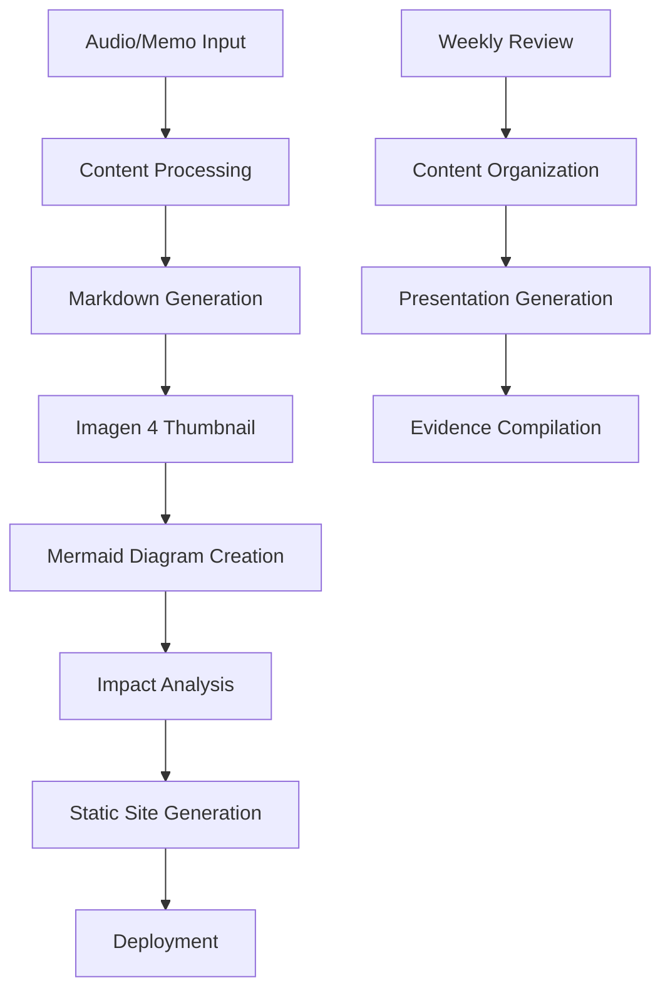
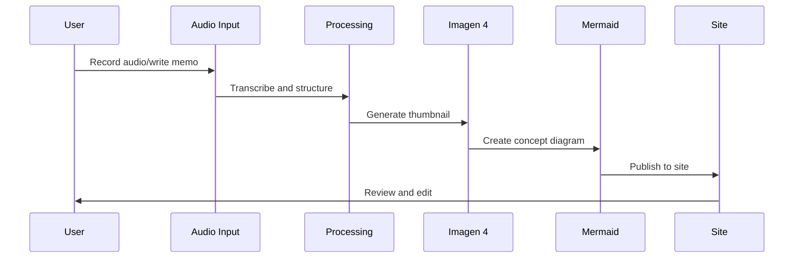

# Personal Homepage/Digital Garden - Technical Architecture Design

**Project**: Exhibition Insights Digital Garden
**Version**: 1.0
**Date**: 2025-10-04

## Overview

A modern digital garden system for capturing, organizing, and visualizing exhibition insights and inspirations with automated visual enhancement and impact analysis capabilities.

## Core Requirements Summary

- **Content Input**: Audio recordings, text memos, markdown-based organization
- **Visual Enhancement**: Google Imagen 4 automatic thumbnail generation
- **Visualization**: Mermaid diagrams for concept mapping
- **Analysis**: Social impact assessment framework
- **Frequency**: Weekly content updates and organization
- **Technology**: Modern web stack (Astro/SvelteKit/Next.js)
- **Design**: Mobile-responsive, professional presentation quality

## Recommended Technology Stack

### Primary Framework: **Astro** ⭐
```yaml
rationale:
  content_focus: Perfect for content-heavy sites with markdown
  performance: Static generation with selective hydration
  flexibility: Component islands from multiple frameworks
  seo_optimization: Excellent built-in SEO and performance
  markdown_support: Native markdown with frontmatter processing
  extensibility: Rich plugin ecosystem for content management
```

### Supporting Technologies
```yaml
core_technologies:
  framework: Astro 4.x
  styling: Tailwind CSS + Headless UI
  content: Markdown with frontmatter + YAML data
  diagrams: Mermaid.js integration
  deployment: Vercel (optimal for Astro)

visual_generation:
  primary: Google Imagen 4 SDK
  storage: Cloudinary for image optimization
  fallback: Stable Diffusion (local backup)

data_management:
  content: Local markdown files + Git version control
  metadata: YAML frontmatter + JSON indexes
  search: Fuse.js for client-side content search
  analytics: Privacy-focused analytics (Plausible)

development_tools:
  package_manager: pnpm
  typescript: Full TypeScript integration
  linting: ESLint + Prettier
  testing: Vitest for components
  ci_cd: GitHub Actions
```

## System Architecture

### Content Flow Architecture


### Directory Structure
```
digital-garden/
├── src/
│   ├── components/
│   │   ├── ContentCard.astro
│   │   ├── MermaidDiagram.astro
│   │   ├── ImpactAnalysis.astro
│   │   └── ThumbnailGallery.astro
│   ├── layouts/
│   │   ├── BaseLayout.astro
│   │   └── InsightLayout.astro
│   ├── pages/
│   │   ├── index.astro
│   │   ├── insights/
│   │   │   └── [...slug].astro
│   │   └── api/
│   │       ├── generate-thumbnail.ts
│   │       └── analyze-impact.ts
│   └── utils/
│       ├── imagen-client.ts
│       ├── content-processor.ts
│       └── impact-analyzer.ts
├── content/
│   ├── insights/
│   │   ├── 2025-10-04-exhibition-name.md
│   │   └── weekly-reviews/
│   ├── config/
│   │   ├── categories.yaml
│   │   └── impact-criteria.yaml
│   └── assets/
│       ├── thumbnails/
│       └── diagrams/
├── public/
│   └── images/
├── scripts/
│   ├── audio-to-text.js
│   └── weekly-digest.js
└── astro.config.mjs
```

## Core Features Design

### 1. Content Input System
```typescript
interface ContentInput {
  type: 'audio' | 'memo' | 'structured'
  source: string
  timestamp: Date
  location?: string
  exhibition?: string
  category: string[]
  rawContent: string
  processedContent?: string
}

interface InsightEntry {
  id: string
  title: string
  date: Date
  exhibition: string
  category: string[]
  content: string
  thumbnail?: string
  diagrams?: MermaidDiagram[]
  impact: ImpactAnalysis
  tags: string[]
  references: string[]
}
```

### 2. Google Imagen 4 Integration
```typescript
// utils/imagen-client.ts
export class ImagenClient {
  async generateThumbnail(
    prompt: string,
    style: 'professional' | 'creative' | 'technical' = 'professional'
  ): Promise<string> {
    // Implementation using Google Cloud Imagen 4 API
    // Aspect ratio: 16:9 for thumbnails
    // Size: 1280x720 optimized for web
    // Style adaptation based on content category
  }

  async enhanceContentVisuals(
    markdownContent: string,
    exhibition: string
  ): Promise<{thumbnail: string, conceptImage?: string}> {
    // Extract key concepts from markdown
    // Generate contextual thumbnails
    // Create supporting visual elements
  }
}
```

### 3. Mermaid Diagram System
```typescript
// components/MermaidDiagram.astro
interface DiagramConfig {
  type: 'flowchart' | 'mindmap' | 'timeline' | 'impact-flow'
  theme: 'default' | 'dark' | 'neutral'
  responsive: boolean
  exportable: boolean
}

// Auto-generate diagrams from structured content
function generateImpactFlowDiagram(insight: InsightEntry): string {
  return `
  graph TD
    A[${insight.exhibition}] --> B[Key Insight]
    B --> C[Potential Impact]
    C --> D[Implementation Path]
    D --> E[Measurable Outcome]
  `
}
```

### 4. Impact Analysis Framework
```yaml
impact_dimensions:
  business_value:
    - market_opportunity: "Market size and addressability"
    - competitive_advantage: "Unique positioning potential"
    - revenue_potential: "Monetization feasibility"

  implementation_feasibility:
    - technical_complexity: "Development effort required"
    - resource_requirements: "Budget and team needs"
    - timeline_estimate: "Time to market assessment"

  social_impact:
    - user_benefit: "End user value creation"
    - societal_contribution: "Broader social implications"
    - sustainability: "Environmental and long-term considerations"

  strategic_alignment:
    - vision_fit: "Alignment with personal/professional goals"
    - skill_development: "Learning and growth opportunities"
    - network_expansion: "Relationship and connection building"
```

### 5. Weekly Review System
```typescript
interface WeeklyDigest {
  week: string
  totalInsights: number
  topCategories: string[]
  keyThemes: string[]
  actionableItems: ActionItem[]
  impactSummary: ImpactSummary
  generatedPresentation?: string
}

// Automated weekly processing
export async function generateWeeklyDigest(): Promise<WeeklyDigest> {
  // Collect week's insights
  // Identify patterns and themes
  // Generate actionable recommendations
  // Create presentation-ready summary
  // Compile evidence and references
}
```

## User Experience Design

### Content Creation Workflow


### Mobile-First Interface
```css
/* Responsive Design Principles */
.content-grid {
  display: grid;
  grid-template-columns: 1fr;
  gap: 1rem;

  @media (min-width: 768px) {
    grid-template-columns: repeat(2, 1fr);
  }

  @media (min-width: 1024px) {
    grid-template-columns: repeat(3, 1fr);
  }
}

.insight-card {
  /* Mobile-optimized touch targets */
  min-height: 44px; /* iOS accessibility guideline */
  padding: 1rem;
  border-radius: 8px;
  box-shadow: 0 2px 4px rgba(0, 0, 0, 0.1);
}
```

## Development Phases

### Phase 1: Foundation (Week 1-2)
- [ ] Set up Astro project with TypeScript
- [ ] Configure Tailwind CSS and basic layouts
- [ ] Create markdown content structure
- [ ] Implement basic content rendering

### Phase 2: Content Management (Week 3-4)
- [ ] Develop content input processing
- [ ] Create insight entry templates
- [ ] Implement content organization system
- [ ] Add search and filtering capabilities

### Phase 3: Visual Enhancement (Week 5-6)
- [ ] Integrate Google Imagen 4 API
- [ ] Implement thumbnail generation pipeline
- [ ] Add Mermaid diagram support
- [ ] Create visual content gallery

### Phase 4: Analysis & Intelligence (Week 7-8)
- [ ] Build impact analysis framework
- [ ] Implement weekly digest generation
- [ ] Create presentation export functionality
- [ ] Add evidence compilation features

### Phase 5: Polish & Deploy (Week 9-10)
- [ ] Optimize performance and SEO
- [ ] Implement CI/CD pipeline
- [ ] Add analytics and monitoring
- [ ] Deploy to production

## Performance Considerations

### Static Generation Optimization
```typescript
// astro.config.mjs
export default defineConfig({
  output: 'static',
  integrations: [
    tailwind(),
    mdx(),
    sitemap(),
    robotsTxt()
  ],
  vite: {
    build: {
      rollupOptions: {
        output: {
          manualChunks: {
            'vendor': ['react', 'react-dom'],
            'mermaid': ['mermaid'],
            'utils': ['fuse.js', 'date-fns']
          }
        }
      }
    }
  },
  image: {
    service: cloudinaryService() // Optimized image delivery
  }
})
```

### Content Loading Strategy
```typescript
// Progressive loading for large content sets
export async function getStaticPaths() {
  const insights = await getCollection('insights')

  return insights.map(insight => ({
    params: { slug: insight.slug },
    props: {
      insight,
      relatedInsights: await getRelatedInsights(insight.id, 3)
    }
  }))
}
```

## Security & Privacy

### API Key Management
```typescript
// Environment variables for sensitive data
const IMAGEN_API_KEY = import.meta.env.IMAGEN_API_KEY
const CLOUDINARY_URL = import.meta.env.CLOUDINARY_URL

// Server-side only API calls
export async function POST({request}: APIRoute) {
  // Validate request origin
  // Rate limiting
  // Input sanitization
  // Secure API interactions
}
```

### Content Privacy
```yaml
privacy_controls:
  content_visibility:
    - public: "Published insights"
    - private: "Personal drafts and sensitive content"
    - archived: "Historical content with limited access"

  data_handling:
    - no_external_tracking: "Privacy-focused analytics only"
    - content_ownership: "Full user control over all content"
    - export_capability: "Complete data portability"
```

## Maintenance & Evolution

### Content Lifecycle Management
```typescript
interface ContentLifecycle {
  draft: 'Initial capture and processing'
  review: 'Weekly organization and enhancement'
  published: 'Public availability with full features'
  archived: 'Long-term storage with search capability'
  presentation: 'Export for external presentation use'
}
```

### System Evolution Path
```mermaid
gantt
    title Development & Enhancement Timeline
    dateFormat  YYYY-MM-DD
    section Foundation
    Core System        :done, foundation, 2025-10-04, 2025-10-18
    section Enhancement
    AI Integration     :active, ai-features, 2025-10-19, 2025-11-01
    section Intelligence
    Advanced Analytics :future, analytics, 2025-11-02, 2025-11-16
    section Ecosystem
    API & Integration  :future, api, 2025-11-17, 2025-12-01
```

## Success Metrics

### Content Quality Metrics
- Weekly insight capture rate
- Content organization efficiency
- Presentation generation success rate
- Visual enhancement utilization

### System Performance Metrics
- Page load speed (<2s target)
- Mobile responsiveness score (>95)
- SEO performance metrics
- User engagement patterns

### Impact Assessment Metrics
- Actionable insights generated per week
- Implementation rate of analyzed opportunities
- Presentation utilization and feedback
- Long-term pattern recognition accuracy

---

**Next Steps**: Begin Phase 1 implementation with Astro project setup and basic content architecture.