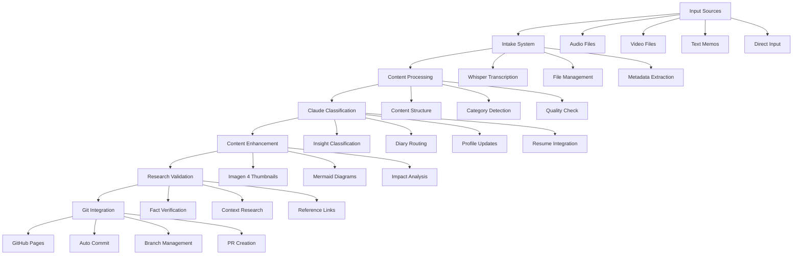

# Digital Garden Implementation Workflow
**Project**: Exhibition Insights Digital Garden with Automated Pipeline
**Version**: 2.0
**Generated**: 2025-10-04

## 🎯 Project Overview

### Core Objectives
1. **Digital Garden Foundation**: Astro-based content management system
2. **Automated Content Pipeline**: Audio/video → transcription → classification → publication
3. **Intelligent Enhancement**: AI-powered thumbnails, diagrams, and impact analysis
4. **Research Integration**: Perplexity API for fact verification and context enrichment
5. **Autonomous Operations**: Git automation and GitHub Pages deployment

### Architecture Enhancement


## 📋 Implementation Schedule

### Phase 1: Enhanced Foundation (Week 1-2)
**Objective**: Extend existing Astro architecture with automation components

#### Week 1: Infrastructure Setup
- [ ] **Day 1-2**: Enhanced directory structure with input management
- [ ] **Day 3-4**: Whisper integration and transcription pipeline
- [ ] **Day 5-7**: Claude API integration and prompt templates

#### Week 2: Core Pipeline Development
- [ ] **Day 8-9**: Content classification system
- [ ] **Day 10-12**: File management and Git integration
- [ ] **Day 13-14**: Basic automation testing and validation

### Phase 2: Intelligent Processing (Week 3-4)
**Objective**: Implement AI-powered content enhancement and research integration

#### Week 3: Enhancement Systems
- [ ] **Day 15-16**: Imagen 4 integration enhancement
- [ ] **Day 17-18**: Advanced Mermaid diagram generation
- [ ] **Day 19-21**: Impact analysis automation

#### Week 4: Research Integration
- [ ] **Day 22-23**: Perplexity API integration
- [ ] **Day 24-25**: Fact verification pipeline
- [ ] **Day 26-28**: Context enrichment and reference management

### Phase 3: Automation & Integration (Week 5-6)
**Objective**: Complete end-to-end automation and deployment pipeline

#### Week 5: Workflow Automation
- [ ] **Day 29-30**: Complete processing pipeline integration
- [ ] **Day 31-32**: Git automation and branch management
- [ ] **Day 33-35**: GitHub Actions workflow enhancement

#### Week 6: Testing & Optimization
- [ ] **Day 36-37**: End-to-end testing and validation
- [ ] **Day 38-39**: Performance optimization
- [ ] **Day 40-42**: Documentation and user guides

## 🏗️ Detailed Implementation Tasks

### A. Enhanced Directory Structure
```
digital-garden/
├── input/                          # New: Input file management
│   ├── .gitkeep                   # Track directory, ignore contents
│   ├── audio/                     # Audio files (.m4a, .wav, .mp3)
│   ├── video/                     # Video files (.mp4, .mov, .avi)
│   ├── text/                      # Text memos and notes
│   └── processed/                 # Processed files archive
├── automation/                     # New: Automation scripts
│   ├── transcription/
│   │   ├── whisper_processor.py   # Enhanced Whisper integration
│   │   ├── audio_converter.py     # Format conversion utilities
│   │   └── transcription_queue.py # Batch processing management
│   ├── classification/
│   │   ├── claude_client.py       # Claude API integration
│   │   ├── prompt_templates.py    # Classification prompts
│   │   └── content_router.py      # Content type routing
│   ├── research/
│   │   ├── perplexity_client.py   # Perplexity API integration
│   │   ├── fact_checker.py        # Fact verification system
│   │   └── reference_manager.py   # Reference and citation management
│   └── git_automation/
│       ├── git_manager.py         # Git operations automation
│       ├── branch_strategy.py     # Branch management logic
│       └── commit_generator.py    # Automated commit messages
├── src/ [existing enhanced]
├── content/ [existing enhanced]
├── scripts/ [enhanced]
│   ├── process_input.py           # Master processing script
│   ├── batch_process.py           # Batch processing utilities
│   └── maintenance.py             # System maintenance tasks
└── config/
    ├── automation_config.yaml     # Automation settings
    ├── claude_prompts.yaml        # Classification prompts
    └── processing_rules.yaml      # Content processing rules
```

### B. Core Automation Components

#### B1. Whisper Transcription Enhanced
```python
# automation/transcription/whisper_processor.py
import os
import torch
import subprocess
from pathlib import Path
from typing import Dict, List, Optional
from dataclasses import dataclass

@dataclass
class TranscriptionResult:
    text: string
    confidence: float
    segments: List[Dict]
    processing_time: float
    source_file: Path
    metadata: Dict

class EnhancedWhisperProcessor:
    def __init__(self, config: Dict):
        self.model_id = config.get('model_id', 'kotoba-tech/kotoba-whisper-v2.0')
        self.device = 0 if torch.cuda.is_available() else -1
        self.output_dir = Path(config.get('output_dir', 'input/processed'))

    def process_file(self, input_path: Path) -> TranscriptionResult:
        """Enhanced transcription with metadata extraction"""
        # Audio format conversion if needed
        # Whisper processing with enhanced error handling
        # Metadata extraction (duration, quality, etc.)
        # Quality assessment and confidence scoring
        pass

    def batch_process(self, input_dir: Path) -> List[TranscriptionResult]:
        """Batch process all audio/video files in directory"""
        pass

    def cleanup_processed(self, days_old: int = 7):
        """Clean up old processed files"""
        pass
```

#### B2. Claude Classification System
```python
# automation/classification/claude_client.py
import anthropic
from typing import Dict, List, Optional
from enum import Enum

class ContentType(Enum):
    INSIGHT = "insight"
    DIARY = "diary"
    RESUME_UPDATE = "resume_update"
    PROFILE_UPDATE = "profile_update"
    MISC = "misc"

class ClaudeClassifier:
    def __init__(self, api_key: str, prompt_templates: Dict):
        self.client = anthropic.Anthropic(api_key=api_key)
        self.templates = prompt_templates

    def classify_content(self, content: str, metadata: Dict) -> Dict:
        """Classify content and determine processing route"""
        prompt = self.templates['classification'].format(
            content=content,
            metadata=metadata
        )

        response = self.client.messages.create(
            model="claude-3-5-sonnet-20241022",
            max_tokens=1000,
            messages=[{"role": "user", "content": prompt}]
        )

        return self.parse_classification_response(response.content)

    def generate_structured_content(self, content: str, content_type: ContentType) -> Dict:
        """Generate structured content based on type"""
        template = self.templates[content_type.value]
        # Use appropriate template for each content type
        pass

    def extract_metadata(self, content: str) -> Dict:
        """Extract structured metadata from content"""
        pass
```

#### B3. Perplexity Research Integration
```python
# automation/research/perplexity_client.py
import requests
from typing import Dict, List, Optional
from dataclasses import dataclass

@dataclass
class ResearchResult:
    query: str
    summary: str
    sources: List[Dict]
    confidence: float
    citations: List[str]

class PerplexityResearcher:
    def __init__(self, api_key: str):
        self.api_key = api_key
        self.base_url = "https://api.perplexity.ai"
        self.headers = {
            "Authorization": f"Bearer {api_key}",
            "Content-Type": "application/json"
        }

    def verify_facts(self, content: str, claims: List[str]) -> Dict:
        """Verify factual claims in content"""
        verification_results = {}

        for claim in claims:
            query = f"Verify this claim: {claim}"
            result = self.search(query)
            verification_results[claim] = {
                'verified': self.assess_verification(result),
                'sources': result.sources,
                'confidence': result.confidence
            }

        return verification_results

    def research_context(self, topic: str, exhibition: str) -> ResearchResult:
        """Research additional context for exhibition insights"""
        query = f"{topic} at {exhibition} latest developments trends"
        return self.search(query)

    def search(self, query: str) -> ResearchResult:
        """Perform Perplexity search"""
        payload = {
            "model": "llama-3.1-sonar-huge-128k-online",
            "messages": [
                {"role": "user", "content": query}
            ],
            "return_citations": True,
            "return_sources": True
        }

        response = requests.post(
            f"{self.base_url}/chat/completions",
            headers=self.headers,
            json=payload
        )

        return self.parse_response(response.json())
```

#### B4. Git Automation System
```python
# automation/git_automation/git_manager.py
import git
import os
from datetime import datetime
from typing import Dict, List, Optional
from pathlib import Path

class GitAutomationManager:
    def __init__(self, repo_path: Path, config: Dict):
        self.repo = git.Repo(repo_path)
        self.config = config
        self.main_branch = config.get('main_branch', 'main')

    def create_content_branch(self, content_type: str, date: str) -> str:
        """Create branch for new content"""
        branch_name = f"content/{content_type}-{date}"

        # Ensure we're on main and up to date
        self.repo.git.checkout(self.main_branch)
        self.repo.git.pull('origin', self.main_branch)

        # Create and checkout new branch
        new_branch = self.repo.create_head(branch_name)
        new_branch.checkout()

        return branch_name

    def commit_changes(self, files: List[Path], message: str) -> str:
        """Commit changes with automated message generation"""
        # Stage files
        for file in files:
            self.repo.git.add(str(file))

        # Generate enhanced commit message
        enhanced_message = self.generate_commit_message(message, files)

        # Commit
        commit = self.repo.index.commit(enhanced_message)
        return commit.hexsha

    def create_pull_request(self, branch: str, title: str, body: str) -> Optional[str]:
        """Create pull request using GitHub CLI"""
        try:
            import subprocess

            # Push branch
            self.repo.git.push('origin', branch)

            # Create PR using GitHub CLI
            cmd = [
                'gh', 'pr', 'create',
                '--title', title,
                '--body', body,
                '--head', branch,
                '--base', self.main_branch
            ]

            result = subprocess.run(cmd, capture_output=True, text=True)
            return result.stdout.strip() if result.returncode == 0 else None

        except Exception as e:
            print(f"Failed to create PR: {e}")
            return None

    def generate_commit_message(self, base_message: str, files: List[Path]) -> str:
        """Generate enhanced commit message"""
        file_types = self.categorize_files(files)

        message_parts = [
            base_message,
            "",
            "Files changed:",
        ]

        for category, file_list in file_types.items():
            message_parts.append(f"- {category}: {len(file_list)} files")

        message_parts.extend([
            "",
            "🤖 Generated with Digital Garden Automation",
            f"Processed at: {datetime.now().isoformat()}"
        ])

        return "\n".join(message_parts)
```

### C. Master Processing Script
```python
# scripts/process_input.py
import asyncio
import argparse
from pathlib import Path
from typing import Dict, List
from automation.transcription.whisper_processor import EnhancedWhisperProcessor
from automation.classification.claude_client import ClaudeClassifier
from automation.research.perplexity_client import PerplexityResearcher
from automation.git_automation.git_manager import GitAutomationManager

class DigitalGardenProcessor:
    def __init__(self, config_path: Path):
        self.config = self.load_config(config_path)
        self.setup_components()

    def setup_components(self):
        """Initialize all processing components"""
        self.transcriber = EnhancedWhisperProcessor(self.config['transcription'])
        self.classifier = ClaudeClassifier(
            self.config['claude']['api_key'],
            self.config['claude']['prompts']
        )
        self.researcher = PerplexityResearcher(self.config['perplexity']['api_key'])
        self.git_manager = GitAutomationManager(
            Path('.'),
            self.config['git']
        )

    async def process_all_inputs(self) -> Dict:
        """Main processing pipeline"""
        results = {
            'processed': [],
            'errors': [],
            'commits': []
        }

        # Step 1: Transcribe audio/video files
        transcription_results = await self.transcribe_media_files()

        # Step 2: Process all content (transcribed + text)
        for result in transcription_results:
            try:
                processed = await self.process_content(result)
                results['processed'].append(processed)
            except Exception as e:
                results['errors'].append({'file': result.source_file, 'error': str(e)})

        # Step 3: Create git commits and PRs
        if results['processed']:
            commit_info = await self.commit_processed_content(results['processed'])
            results['commits'] = commit_info

        return results

    async def process_content(self, content_data) -> Dict:
        """Process individual content item through full pipeline"""
        # Classify content
        classification = self.classifier.classify_content(
            content_data.text,
            content_data.metadata
        )

        # Generate structured content based on classification
        structured_content = self.classifier.generate_structured_content(
            content_data.text,
            classification['type']
        )

        # Research and verify if needed
        if classification.get('needs_research', False):
            research_data = await self.research_content(structured_content)
            structured_content['research'] = research_data

        # Generate visual enhancements
        if classification['type'] == 'insight':
            structured_content['thumbnail'] = await self.generate_thumbnail(structured_content)
            structured_content['diagrams'] = await self.generate_diagrams(structured_content)

        # Save to appropriate location
        file_path = self.save_structured_content(structured_content, classification['type'])

        return {
            'source': content_data.source_file,
            'type': classification['type'],
            'output_path': file_path,
            'structured_content': structured_content
        }

def main():
    parser = argparse.ArgumentParser(description='Digital Garden Content Processor')
    parser.add_argument('--config', type=Path, default='config/automation_config.yaml')
    parser.add_argument('--batch', action='store_true', help='Process all files in input directory')
    parser.add_argument('--file', type=Path, help='Process specific file')
    parser.add_argument('--dry-run', action='store_true', help='Show what would be processed')

    args = parser.parse_args()

    processor = DigitalGardenProcessor(args.config)

    if args.batch:
        results = asyncio.run(processor.process_all_inputs())
        print(f"Processed {len(results['processed'])} items")
        print(f"Errors: {len(results['errors'])}")
        print(f"Commits: {len(results['commits'])}")
    elif args.file:
        # Process single file
        pass
    else:
        print("Specify --batch or --file")

if __name__ == "__main__":
    main()
```

## 🧪 Testing Strategy

### Unit Testing
- [ ] **Transcription Module**: Test audio format support, quality thresholds
- [ ] **Classification Module**: Test prompt templates, response parsing
- [ ] **Research Module**: Test API integration, fact verification accuracy
- [ ] **Git Module**: Test branch creation, commit generation, PR creation

### Integration Testing
- [ ] **End-to-End Pipeline**: Full audio → publication workflow
- [ ] **Error Handling**: Malformed inputs, API failures, Git conflicts
- [ ] **Performance Testing**: Batch processing, memory usage, processing times

### Quality Assurance
```yaml
quality_gates:
  transcription_accuracy: ">95%"
  classification_accuracy: ">90%"
  research_relevance: ">85%"
  git_automation_success: ">98%"
  end_to_end_completion: ">95%"
```

## 🚀 Deployment Strategy

### GitHub Actions Workflow
```yaml
# .github/workflows/digital-garden-automation.yml
name: Digital Garden Automation

on:
  schedule:
    - cron: '0 */6 * * *'  # Every 6 hours
  workflow_dispatch:
  push:
    paths:
      - 'input/**'

jobs:
  process-content:
    runs-on: ubuntu-latest

    steps:
    - uses: actions/checkout@v4

    - name: Setup Python
      uses: actions/setup-python@v4
      with:
        python-version: '3.11'

    - name: Install dependencies
      run: |
        pip install -r automation/requirements.txt

    - name: Process new content
      env:
        CLAUDE_API_KEY: ${{ secrets.CLAUDE_API_KEY }}
        PERPLEXITY_API_KEY: ${{ secrets.PERPLEXITY_API_KEY }}
        GOOGLE_CLOUD_PROJECT_ID: ${{ secrets.GOOGLE_CLOUD_PROJECT_ID }}
      run: |
        python scripts/process_input.py --batch

    - name: Build and deploy
      run: |
        npm ci
        npm run build

    - name: Deploy to GitHub Pages
      uses: peaceiris/actions-gh-pages@v3
      with:
        github_token: ${{ secrets.GITHUB_TOKEN }}
        publish_dir: ./dist
```

## 🔧 Configuration Management

### Automation Configuration
```yaml
# config/automation_config.yaml
transcription:
  model_id: "kotoba-tech/kotoba-whisper-v2.0"
  output_format: "segments"
  quality_threshold: 0.8
  batch_size: 4
  supported_formats: [".m4a", ".wav", ".mp3", ".mp4", ".mov"]

classification:
  model: "claude-3-5-sonnet-20241022"
  confidence_threshold: 0.7
  templates_path: "config/claude_prompts.yaml"

research:
  enable_fact_checking: true
  confidence_threshold: 0.8
  max_sources: 5
  cache_duration: 24  # hours

git_automation:
  main_branch: "main"
  branch_prefix: "content/"
  auto_pr: true
  pr_reviewers: []
  merge_strategy: "squash"

processing:
  batch_size: 10
  max_concurrent: 3
  retry_attempts: 3
  cleanup_days: 7
```

### Prompt Templates
```yaml
# config/claude_prompts.yaml
classification: |
  Analyze this content and classify it into one of these categories:
  - insight: Exhibition insights, technical discoveries, business observations
  - diary: Personal reflections, daily experiences, thoughts
  - resume_update: Professional achievements, skills, project updates
  - profile_update: Personal information, contact details, background changes
  - misc: Other content that doesn't fit above categories

  Content: {content}
  Metadata: {metadata}

  Respond with JSON:
  {{
    "type": "insight|diary|resume_update|profile_update|misc",
    "confidence": 0.0-1.0,
    "rationale": "brief explanation",
    "suggested_title": "content title",
    "categories": ["category1", "category2"],
    "needs_research": true/false,
    "priority": "low|medium|high"
  }}

insight_generation: |
  Transform this content into a structured exhibition insight:

  Content: {content}

  Generate markdown with frontmatter:
  - Extract key insights and technical details
  - Identify business implications
  - Suggest related categories and tags
  - Create compelling title and description
  - Include impact analysis if relevant

diary_generation: |
  Transform this content into a personal diary entry:

  Content: {content}

  Create a reflective diary entry with:
  - Date and context
  - Main experiences or thoughts
  - Personal insights and learnings
  - Future considerations or actions
```

## 📊 Monitoring & Analytics

### Performance Metrics
- **Processing Speed**: Average time per content item
- **Accuracy Rates**: Classification and transcription accuracy
- **System Uptime**: Automation pipeline availability
- **Error Rates**: Failed processing attempts and reasons

### Content Metrics
- **Content Volume**: Items processed per day/week/month
- **Content Types**: Distribution across categories
- **Research Usage**: Fact-checking and enhancement statistics
- **Publication Rate**: Successfully published content

### Quality Metrics
- **User Satisfaction**: Manual review and correction rates
- **Research Accuracy**: Fact-checking precision
- **Visual Enhancement**: Thumbnail and diagram generation success
- **End-to-End Success**: Complete pipeline completion rate

---

## ✅ Success Criteria

1. **Automated Pipeline**: 95%+ success rate for end-to-end processing
2. **Content Quality**: 90%+ accuracy in classification and routing
3. **Research Integration**: Relevant fact-checking and context enhancement
4. **Git Automation**: Seamless version control and deployment
5. **User Experience**: Minimal manual intervention required
6. **Performance**: <5 minutes processing time per content item
7. **Reliability**: 99%+ uptime for automated processing

---

**Next Phase**: Execute /sc:design for detailed component design and architecture refinement.