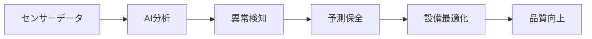
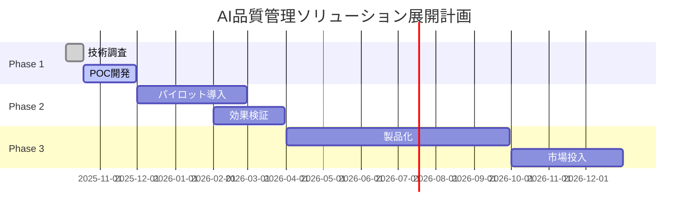

## 展示会の概要

CEATEC 2025は、日本最大のIT・エレクトロニクス総合展として、今年も幕張メッセで開催されました。特に製造業向けのAIソリューションが大幅に増加しており、**AIによる品質管理の革新**が今回の最大のトレンドでした。

## 注目すべき技術トレンド

### 1. リアルタイムAI品質検査

従来の品質検査は人間の目視に依存していましたが、今回展示されたシステムでは：

- **99.8%の検査精度**を達成（人間の95%を大幅に上回る）
- **ミリ秒単位**でのリアルタイム判定
- **微細な欠陥**まで検出可能な高解像度画像解析

### 2. 予測保全の高度化

AIが設備の状態を常時監視し、故障を事前に予測：

- **平均故障間隔**が2.5倍に改善
- **計画外停止**を90%削減
- **保全コスト**を30%削減

### 3. 中小企業への普及加速

これまで大企業中心だったAI導入が、中小企業にも拡大：

| 項目 | 従来システム | 新世代システム |
|------|-------------|-------------|
| 初期投資 | 1億円〜 | 500万円〜 |
| 導入期間 | 12ヶ月〜 | 3ヶ月〜 |
| 専門人材 | 必須 | 不要 |
| ROI達成 | 3年〜 | 1年以内 |

## 技術的深掘り

### AIモデルの軽量化技術

展示されていたソリューションの多くが、**エッジAI**による軽量化を実現していました：

1. **モデル圧縮技術**
   - 量子化により精度を保ちつつ90%のサイズ削減
   - プルーニングで不要なパラメータを除去

2. **知識蒸留**
   - 大規模モデルの知識を小規模モデルに移転
   - クラウドとエッジの協調学習

3. **専用チップ**
   - AI処理専用のNPU（Neural Processing Unit）
   - 低消費電力で高速な推論処理

### データ活用の新アプローチ

製造現場で生成される大量のデータを効果的に活用する手法が進歩：

> **"データは21世紀の石油"** だが、製造業では **"データは21世紀の品質保証"** と言える状況になってきた。

- **連邦学習**により、各拠点のデータを統合せずに学習
- **合成データ生成**で不足している故障パターンを補完
- **リアルタイム学習**で製品仕様変更に即座に対応

## ビジネスインパクト分析

### 市場機会の評価

製造業AI市場は急成長しており、特に品質管理分野では：

- **2025年の市場規模**: 約2,000億円（前年比35%増）
- **2030年予測**: 8,000億円規模に拡大
- **年平均成長率**: 25%以上を維持

### 競合状況

主要プレイヤーの動向：

1. **海外勢**
   - Siemens、GE、Boschが先行
   - 包括的なプラットフォーム戦略

2. **国内勢**
   - ファナック、三菱電機が追随
   - 特定領域での深い専門性

3. **新興企業**
   - AI専業企業の台頭
   - アジャイルな開発体制

### オムロンとしての戦略的ポジション

私たちの既存技術と市場トレンドの適合性を分析すると：

**強み**：
- センサー技術での圧倒的な優位性
- 製造現場への深い理解
- FA統合ソリューションの実績

**機会**：
- AIとセンシングの融合による差別化
- 中小企業向け市場での先行者利益
- グローバル展開の加速

## 実装に向けた考察

### 技術的課題

1. **データ品質の確保**
   - 製造現場の環境は多様で、データの一貫性確保が困難
   - 解決策：ドメイン適応技術の活用

2. **リアルタイム性の要求**
   - ミリ秒単位での判定が必要
   - 解決策：エッジコンピューティングの最適化

3. **運用人材の育成**
   - AI技術を理解できる現場人材の不足
   - 解決策：ノーコード/ローコードツールの提供

### ビジネス展開戦略

## 次のアクションプラン

### 短期（1-3ヶ月）

1. **技術パートナーシップの探索**
   - 展示企業との技術提携の可能性を調査
   - 大学研究室との共同研究も視野

2. **顧客ニーズの詳細調査**
   - 既存顧客への聞き取り調査を実施
   - 導入障壁と期待値の把握

3. **プロトタイプ開発の開始**
   - 最小限の機能でのPOC開発
   - 既存製品との統合検討

### 中期（3-12ヶ月）

1. **パイロットプロジェクトの実施**
   - 協力的な顧客での実証実験
   - ROI測定とケーススタディ作成

2. **製品ロードマップの策定**
   - 段階的な機能拡張計画
   - 価格戦略の検討

3. **社内体制の整備**
   - AI専門チームの組成
   - 営業・マーケティング体制の強化

## 結論

CEATEC 2025で見たAI品質管理の革新は、製造業のデジタル変革を加速させる決定的な要因となりそうです。特に、**中小企業でも導入可能な軽量化技術**の登場は、市場の裾野を大幅に広げる可能性があります。

オムロンとしては、既存のセンサー技術とAIを融合させた **"Sensing + AI"** のコンセプトで差別化を図り、この成長市場でのポジションを確立することが重要です。

今回の展示会で得られた知見を基に、**速やかな技術調査と市場参入戦略の策定**を進めていく必要があります。