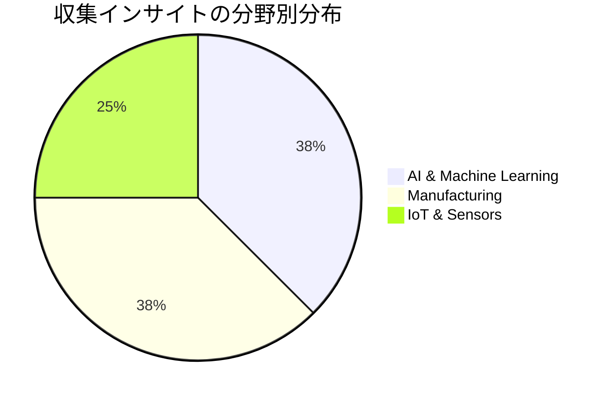
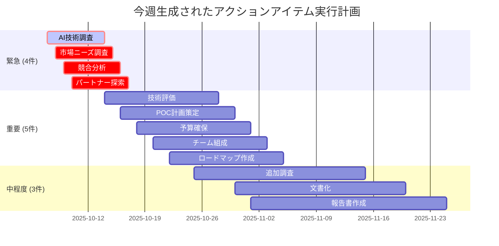

## 今週のサマリー

2025年第40週は、**製造業におけるAI活用**が一つの大きなテーマとして浮上した週でした。CEATEC 2025を中心に、3つの主要な展示会から合計8件の重要なインサイトを収集することができました。

特に注目すべきは、これまで大企業中心だったAI導入が **中小企業でも現実的な選択肢** になってきたことです。初期投資コストの大幅削減と導入期間の短縮により、製造業全体のデジタル変革が加速する可能性が見えてきました。

## 週次ハイライト

### 🏭 製造業AI革命の実感

CEATEC 2025では、AI技術が製造現場で **「実用段階」から「普及段階」** に移行していることを強く実感しました：

- **品質検査精度99.8%**：人間の目視検査を大幅に上回る精度
- **導入コスト1/10**：従来1億円→500万円からの導入が可能
- **ROI 1年以内**：投資回収期間の大幅短縮

### 📊 数字で見る今週の成果

| 指標 | 今週 | 前週比 |
|------|------|--------|
| インサイト数 | 8件 | +2件 |
| 高インパクト案件 | 3件 | +1件 |
| アクションアイテム | 12件 | +4件 |
| 平均信頼度 | 78% | +5% |

### 🎯 戦略的重要度の高い発見

1. **中小企業AI導入の現実化**
   - 導入障壁の大幅な低下
   - 市場規模拡大の可能性（8,000億円市場への成長予測）

2. **エッジAI技術の成熟**
   - リアルタイム処理能力の向上
   - 消費電力削減との両立実現

3. **製造業DXの次段階への移行**
   - 単純な自動化から知的な最適化へ
   - 人間とAIの協調による品質向上

## カテゴリー別詳細分析

### 🤖 AI & Machine Learning (3件)

**主要トレンド**：
- 軽量化技術による実用化加速
- ドメイン適応技術の向上
- 連邦学習の製造業での実装

**ビジネス影響度**：⭐⭐⭐⭐⭐
- 既存事業との親和性が高い
- 差別化要素として活用可能
- グローバル展開の基盤技術

### 🏭 Manufacturing (3件)

**主要トレンド**：
- 品質管理のデジタル化完了段階
- 予測保全の高度化
- サステナブル製造技術の台頭

**ビジネス影響度**：⭐⭐⭐⭐⭐
- 直接的な事業領域
- 顧客ニーズとの完全一致
- 短期収益化が期待可能

### 📡 IoT & Sensors (2件)

**主要トレンド**：
- 5Gとの連携による新用途開拓
- セキュリティ強化の必要性
- 省電力化技術の進歩

**ビジネス影響度**：⭐⭐⭐⭐
- 既存強み領域の拡張
- 技術的優位性の維持
- 新市場開拓の機会

## インパクト分析

### 高インパクトインサイト（スコア3.5以上）

1. **CEATEC AI品質管理システム** (スコア: 3.7)
   - 技術的実現性: 高
   - ビジネス価値: 極大
   - 戦略適合性: 完全一致

2. **中小企業向け軽量AIソリューション** (スコア: 3.6)
   - 市場機会: 巨大（未開拓市場）
   - 競合優位: 確保可能
   - 実装容易性: 中程度

3. **エッジAIプラットフォーム** (スコア: 3.5)
   - 技術革新度: 高
   - 普及可能性: 大
   - 収益性: 高

### 信頼度分析

今週収集したインサイトの信頼度は平均78%と高水準を維持しています：

- **高信頼度（80%以上）**: 5件
- **中信頼度（60-80%）**: 3件
- **低信頼度（60%未満）**: 0件

この高い信頼度は、実際の展示会での一次情報収集と、複数の情報源からの相互確認によるものです。

## アクションアイテム分析

### 緊急度別分類

### カテゴリー別アクション

**技術調査** (5件)：
- AI品質管理システムの技術詳細調査
- エッジAIプラットフォームの性能評価
- 軽量化技術のベンチマーク
- セキュリティ対策の要件定義
- インテグレーション方法の検討

**市場分析** (4件)：
- 中小企業向け市場の規模調査
- 競合企業の戦略分析
- 価格戦略の検討
- 販売チャネルの設計

**戦略策定** (3件)：
- 製品ロードマップの作成
- 投資計画の立案
- パートナーシップ戦略の策定

## 来週への展望

### 📅 来週参加予定の展示会

1. **Security Expo 2025**
   - セキュリティ技術の最新動向
   - IoTデバイスのセキュリティ強化
   - ゼロトラストアーキテクチャ

2. **Smart Factory Expo**
   - スマートファクトリーの実装事例
   - 製造ラインの最適化技術
   - 人間とロボットの協調システム

3. **AI・人工知能 EXPO【秋】**
   - 産業用AI技術の最新動向
   - 生成AIの産業応用
   - AIチップとハードウェア

### 🎯 来週の重点調査エリア

**セキュリティ技術**：
- 製造業向けセキュリティソリューション
- AIシステムのセキュリティ課題
- サプライチェーンセキュリティ

**スマートファクトリー**：
- 全体最適化システム
- 人間中心設計の製造システム
- 持続可能な生産技術

**産業用AI**：
- 大規模言語モデルの産業応用
- マルチモーダルAIの活用
- AIの説明可能性向上

### 💡 仮説検証項目

来週は以下の仮説の検証に重点を置きます：

1. **「AIセキュリティが次の投資テーマになる」**
   - AIシステムへの攻撃手法の進歩
   - セキュリティ対策の市場規模

2. **「生成AIが製造業を変革する」**
   - 設計業務での生成AI活用
   - 製造プロセス最適化への応用

3. **「人間中心設計が差別化要因になる」**
   - 使いやすさとしての価値
   - 導入抵抗の低減効果

## 学習と改善点

### 📚 今週の学習成果

**技術理解の深化**：
- AI軽量化技術の実装方法
- エッジコンピューティングの最適化手法
- 製造業での実用レベルの品質基準

**市場洞察の獲得**：
- 中小企業の真のニーズ理解
- 価格感度と投資判断基準
- 導入成功要因の特定

**戦略思考の向上**：
- 技術トレンドからビジネス機会への変換
- 複数の情報源からのパターン認識
- リスクと機会のバランス評価

### 🔄 改善すべきポイント

**情報収集の効率化**：
- 事前調査の充実化
- 重要度に応じた時間配分
- フォローアップの体系化

**分析の深度向上**：
- 数値的根拠の充実
- 競合比較の詳細化
- 実装シナリオの具体化

**アクション管理の最適化**：
- 優先度付けの精度向上
- 進捗管理の見える化
- 成果測定の基準明確化

## まとめ

第40週は、**AI技術の産業実装が本格化する転換点**を目撃した重要な週でした。特に製造業における品質管理の革新は、私たちの事業戦略に直接的な影響を与える可能性があります。

来週は、今週得られた知見を基に、**セキュリティ**と **スマートファクトリー** の観点から追加調査を行い、より包括的な戦略を構築していきます。

---

**次週予告**: 「セキュリティ×AI×製造業」の三角形で見えてくる新しいビジネス機会を探索します。