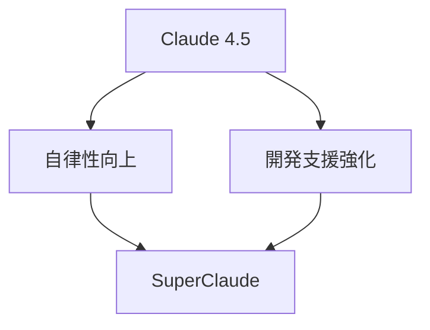

## 概要図

# Claude 4.5の進化：自律性と開発支援機能の大幅強化

## 核心的な洞察
Claude 4.5は自律性と開発支援機能において大きな進化を遂げました。特に注目すべきは、無限ループ問題の解決と論理的整合性の向上による自律的な動作の実現です。また、抽象的なコーディング指示への対応能力が飛躍的に向上し、より実践的な開発支援が可能になりました。

## 詳細
自律性の向上は、システムの論理的判断能力の改善によって実現されました。特に無限ループ問題の解決は、長時間の処理や複雑なタスクの実行を可能にしました。

開発支援機能では、CLI呼び出しによるClaude Code連携が実装され、より柔軟な開発支援が可能になりました。SuperClaude機能では、ペルソナ定義による機能拡張が導入され、プロジェクトの要件に応じた最適な支援が提供できるようになっています。

## 実践的示唆
- SuperClaude機能を活用したカスタマイズされた開発支援の実装
- CLI経由でのClaude Code活用による開発効率の向上
- ペルソナ定義を活用した柔軟なプロジェクト対応
- 抽象的なコーディング指示からの具体的な実装への展開

## まとめ
Claude 4.5は自律性と開発支援機能の両面で大きな進化を遂げ、より実践的な開発現場での活用が期待できます。特にSuperClaude機能とClaude Code ver2.0の組み合わせにより、開発支援ツールとしての新たな可能性が広がっています。
