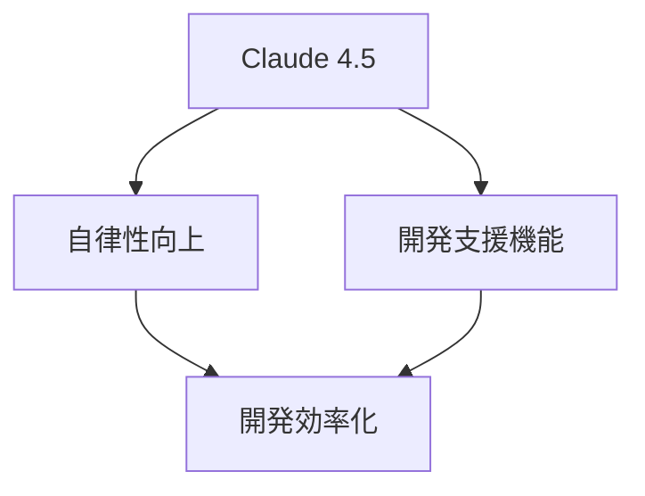

## 概要図

## 核心的な洞察

Claude 4.5は自律性と開発支援機能において大幅な進化を遂げました。特に無限ループの解消と論理的整合性の改善により、複雑な開発タスクへの対応力が強化されています。SuperClaudeの導入により、よりカスタマイズされた開発支援が可能になりました。

## 詳細

自律性の向上は、主に3つの側面で実現されています：
1. 無限ループの自動検知と解消
2. 論理的整合性の維持による安定した出力
3. 複雑な要件への適応能力

開発支援機能では、抽象的なコーディング指示への対応力が向上し、CLI経由でのClaude Code連携が可能になりました。さらに、SuperClaudeではペルソナ定義による柔軟な対応が実現され、高度なプロンプトエンジニアリングが可能になっています。

## 実践的示唆

- 複数機能を組み合わせた開発フローの構築（例：要件分析→コード生成→テスト）
- ペルソナ定義を活用した特定領域での専門的な開発支援の実現
- CLI連携による既存の開発ツールチェーンへの統合
- 複雑な要件をステップバイステップで実装する際のガイド活用

## まとめ

Claude 4.5とSuperClaudeの進化により、より効率的で精度の高い開発支援が実現可能になりました。自律性の向上と拡張された機能を適切に組み合わせることで、開発プロセス全体の最適化が期待できます。
